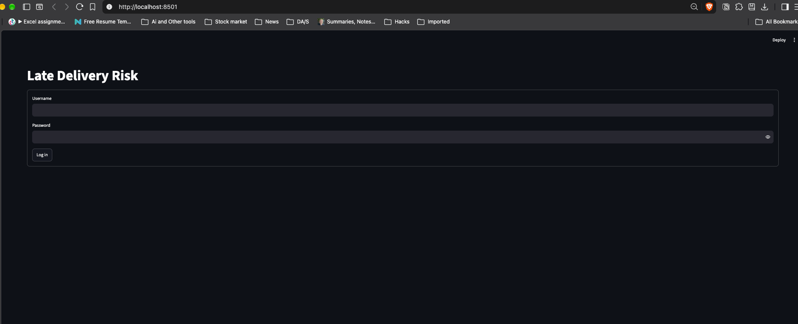
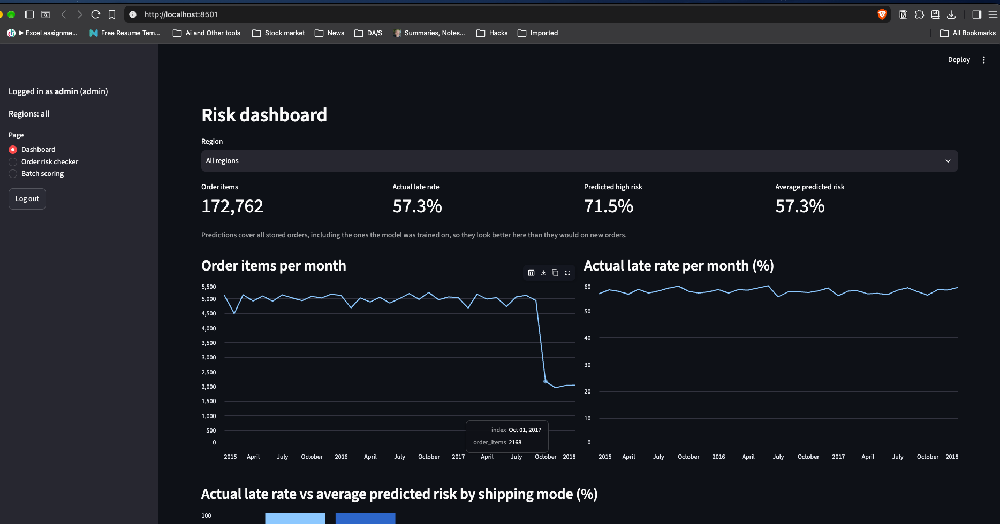
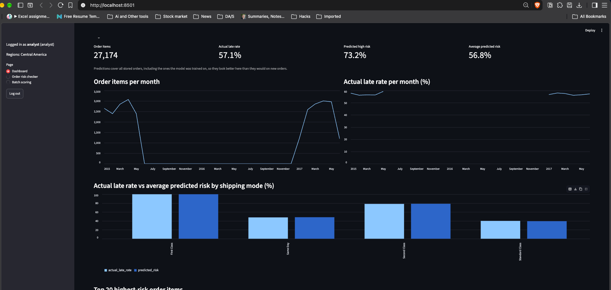
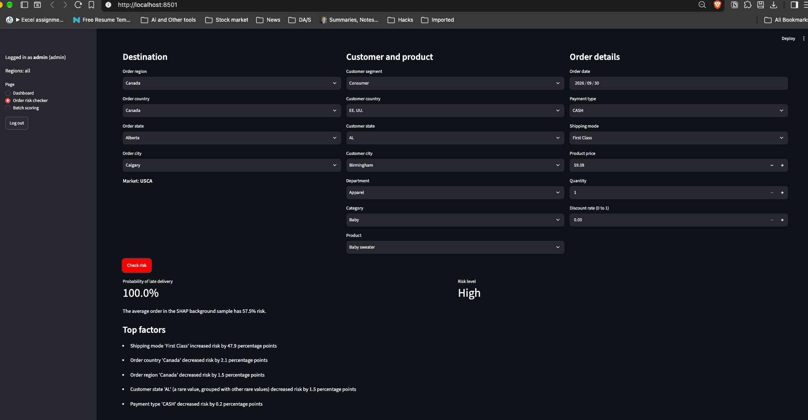
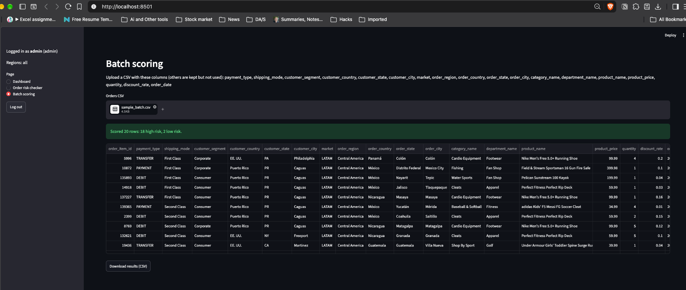

# AI-Driven Late Delivery Risk Prediction and Explainable Insights System for Logistics

M.Sc (Data Science) major project, Chandigarh University.

The system predicts, **at the moment an order is placed**, the probability that an order item will be delivered late, labels it High or Low risk, and explains the prediction with SHAP. A Streamlit app with admin and analyst roles gives a risk dashboard, a single-order risk checker and batch CSV scoring. Everything runs locally: no external APIs and no LLMs in the product.

## Key results

Final model: scikit-learn `HistGradientBoostingClassifier` with a decision threshold of **0.397**, chosen on out-of-fold training predictions so that at least 80% of late deliveries are caught. Test set: 34,553 order items, split by order so no order is in both train and test.

| Model | Precision | Recall | F1 | ROC-AUC |
|---|---|---|---|---|
| Always late (baseline) | 0.573 | 1.000 | 0.728 | 0.500 |
| Shipping mode only (baseline) | 0.883 | 0.539 | 0.670 | 0.739 |
| Logistic regression | 0.859 | 0.557 | 0.676 | 0.731 |
| HistGradientBoosting (threshold 0.5) | 0.833 | 0.574 | 0.679 | 0.732 |
| **HistGradientBoosting (threshold 0.397, final)** | **0.633** | **0.795** | **0.705** | **0.732** |

Source: `reports/model_comparison.csv` (it rounds the threshold to 0.40).

- **Recall matters most:** a missed late delivery costs more than a false alarm.
- **Shipping mode drives almost all of the risk.** The global SHAP analysis gives it a mean effect of about 22 percentage points, and every other feature is below 2 points. A shipping-mode-only baseline ranks orders as well as the full model.
- **No leakage:** every column recorded after shipping or delivery is excluded (actual shipping days, delivery status, shipping date, order status). Tests check this.

## Data

DataCo Smart Supply Chain dataset (Kaggle), file `DataCoSupplyChainDataset.csv`:

- **Raw:** 180,519 rows × 53 columns.
- **After cleaning:** 172,762 order items × 22 columns, 57.3% of them late.

The data is not in the repository. See `docs/data-dictionary.md` for every column and why it was kept or dropped.

## Setup

Requires Python 3.11+ (tested with 3.12.6 on macOS). Run everything from the project root, using the project `.venv`. The full guide is in [`docs/setup.md`](docs/setup.md).

```bash
python3.12 -m venv .venv
```

```bash
.venv/bin/pip install -r requirements.txt
```

Then download the dataset from Kaggle and put `DataCoSupplyChainDataset.csv` in `data/raw/`.

## Prepare the data and train the model

Run these in order:

```bash
.venv/bin/python -m src.data_prep
```

```bash
.venv/bin/python -m src.train
```

```bash
.venv/bin/python -m src.explain
```

```bash
.venv/bin/python -m src.db
```

- **`src.data_prep`** writes `data/processed/orders_clean.csv`.
- **`src.train`** does the following:
  - splits the data 80/20, grouped by order
  - trains the baselines, logistic regression and HistGradientBoosting (grid of 8 settings, grouped 5-fold CV)
  - tunes the threshold
  - writes `models/model.joblib`, `reports/model_comparison.csv` and figures 08–09 in `reports/figures/`

  Training takes a few minutes on a laptop.
- **`src.explain`** writes the global SHAP chart `reports/figures/10_shap_global_importance.png`. The app doesn't need this step.
- **`src.db`** builds `data/app.db` (SQLite) with the orders and two demo users.

## Run the app

```bash
.venv/bin/streamlit run app.py
```

It opens at http://localhost:8501. Demo accounts (for local demos only):

| Username | Password | Sees |
|---|---|---|
| `admin` | `admin123` | All regions |
| `analyst` | `analyst123` | Central America only |

To use other passwords, set `DEMO_ADMIN_PASSWORD` and `DEMO_ANALYST_PASSWORD` before running `src.db` (see `docs/setup.md`).

`docs/sample_batch.csv` is a 20-row file that passes the batch upload validation for both roles.

## Run the tests

```bash
.venv/bin/python -m pytest
```

There are 107 tests. They cover data preparation, features, training, SHAP, the database, upload validation, and login and region access through Streamlit's `AppTest`. All pass (see [`docs/test-report.md`](docs/test-report.md)). Some tests use the built files (`data/processed/orders_clean.csv`, `models/model.joblib`, `data/app.db`) and are skipped when those are missing.

## Screenshots

**Login**



**Risk dashboard (admin, all regions)**



**Risk dashboard (analyst, Central America only)**



**Order risk checker with the top 5 SHAP factors**



**Batch scoring of `docs/sample_batch.csv`**



## Project structure

```
data/raw/              DataCo CSV (git-ignored)
data/processed/        orders_clean.csv (git-ignored)
models/                model.joblib (git-ignored)
src/data_prep.py       cleaning and leakage removal
src/features.py        feature list and preprocessing
src/train.py           split, models, threshold tuning, evaluation
src/explain.py         SHAP explanations
src/db.py              SQLite: users, orders, predictions
app.py                 Streamlit app
notebooks/01_eda.ipynb exploratory data analysis
tests/                 pytest tests
reports/figures/       EDA, model and SHAP figures, diagrams, screenshots
docs/                  documentation (see below)
```

## Documentation

| Document | Contents |
|---|---|
| [`docs/setup.md`](docs/setup.md) | Full setup, build and run steps |
| [`docs/user-manual.md`](docs/user-manual.md) | Screens, roles, SHAP reading, backup, security, troubleshooting |
| [`docs/data-dictionary.md`](docs/data-dictionary.md) | All 53 raw columns with type, range and status |
| [`docs/test-report.md`](docs/test-report.md) | Every test with expected and actual result |
| [`docs/hardware-software.md`](docs/hardware-software.md) | Hardware and software versions |
| [`docs/diagrams/`](docs/diagrams/) | ERD, DFD Level 0/1, architecture, ML pipeline, PERT (Mermaid). PNG exports are in `reports/figures/diagrams/` |
| [`docs/requirements-checklist.md`](docs/requirements-checklist.md) | University requirements and their status |
| [`docs/report-outline.md`](docs/report-outline.md) | Report structure and where each part comes from |
| [`docs/ai-use-log.md`](docs/ai-use-log.md) | Record of AI-assisted tasks |

## Limitations

- **Shipping mode dominates.** Every First Class item in the dataset is labelled late.
- **Precision is 0.633:** about 37% of High-risk flags are on-time orders.
- **The data is historical:** 2015 to January 2018, and some regions have months with no orders.
- **The dashboard's predictions include training orders.**
- **It's a local, single-machine app:** there are no user-management screens, account lockout or audit log.

## AI assistance

This project was developed with the help of an AI coding assistant (Claude Code). All significant AI-assisted tasks, and what I reviewed or changed, are recorded in [`docs/ai-use-log.md`](docs/ai-use-log.md).
