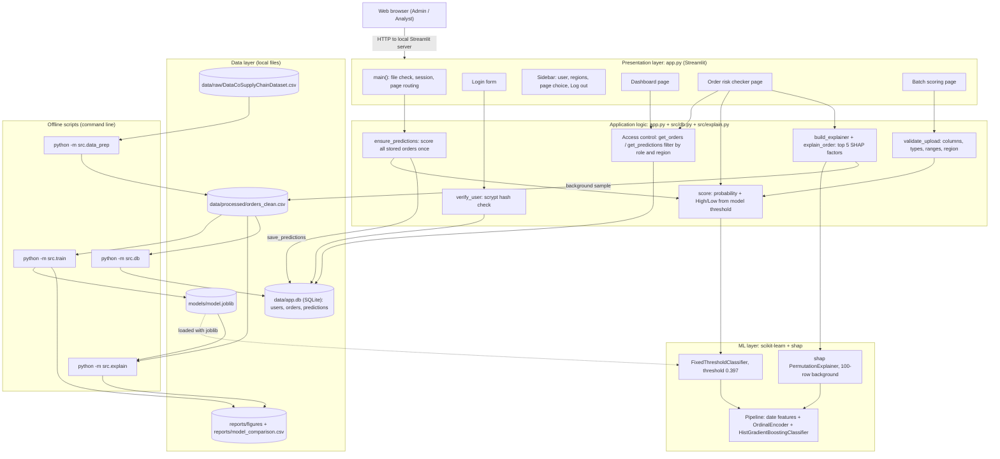

# System Architecture

Source of truth: `app.py` and `src/`. Everything runs on one local machine: no external APIs, no LLMs, no cloud services. The only network use is the browser talking to the local Streamlit server.

Build order of the offline scripts: `src.data_prep` then `src.train`, then `src.explain` (optional, only makes the global SHAP chart) and `src.db`. The app refuses to start its pages if `data/app.db` or `models/model.joblib` is missing.

`ensure_predictions` is called in `main()` after login, before any page is drawn, so it runs on every page load but only scores when the `predictions` table is empty.

## Components

| Layer | Component | File / function | Role |
|---|---|---|---|
| Presentation | Login form | `app.py` `show_login` | Username and password form; shows "Wrong username or password." on failure. |
| Presentation | Sidebar | `app.py` `main` | Shows user and role, allowed regions, page selector (Dashboard, Order risk checker, Batch scoring), Log out button. |
| Presentation | Dashboard | `app.py` `show_dashboard` | KPIs, monthly charts, shipping mode chart, top 20 highest-risk items; admin region selector. |
| Presentation | Order risk checker | `app.py` `show_checker` | Linked dropdowns for one new order; probability, risk level, top 5 SHAP factors. |
| Presentation | Batch scoring | `app.py` `show_batch` | CSV upload, validation messages, results table, CSV download. |
| Application logic | Authentication | `src/db.py` `verify_user`, `check_password` | Salted scrypt hash check, constant-time compare, dummy hash for unknown usernames. |
| Application logic | Access control | `src/db.py` `get_orders`, `get_predictions`; `app.py` `validate_upload` | Admin role sees all rows; any other role only rows with `order_region` equal to its region (parameterized SQL). Uploads by non-admins with other regions are rejected. |
| Application logic | Validation | `app.py` `validate_upload` | Required 18 columns, non-empty file, parseable dates and numbers, no infinite values, quantity whole and at least 1, price not negative, discount 0 to 1. |
| Application logic | Scoring | `app.py` `score`, `ensure_predictions` | `predict_proba` for the probability, `predict` (threshold 0.397) for High/Low. Stored orders are scored once and saved. |
| Application logic | SHAP explainer | `src/explain.py` `build_explainer`, `explain_order` | Fresh explainer per request; plain-language top 5 reasons in percentage points. |
| ML | Saved model | `models/model.joblib` | `FixedThresholdClassifier(FrozenEstimator(pipeline), threshold=0.397)`. |
| ML | Pipeline | `src/features.py`, `src/train.py` | `add_date_features` + `ColumnTransformer` (OrdinalEncoder, min frequency 500; numbers passed through) + `HistGradientBoostingClassifier` with native categorical support. |
| ML | Explainer | `src/explain.py` | `shap.PermutationExplainer` on the probability of late, `Independent` masker over 100 training rows, seed 42. |
| Data | SQLite database | `data/app.db` | Tables `users`, `orders`, `predictions` (see `erd.md`). |
| Data | Processed CSV | `data/processed/orders_clean.csv` | Clean order items; input to training and the database; SHAP background at run time. |
| Data | Model file | `models/model.joblib` | Written by `src.train`, read by `src.explain` and the app. |
| Data | Reports | `reports/figures/`, `reports/model_comparison.csv` | Charts and metrics from the scripts and the EDA notebook. |
| Offline | Build scripts | `src/data_prep.py`, `src/train.py`, `src/explain.py`, `src/db.py` | Each has a `main()` run with `python -m src.<name>` from the project root. |
