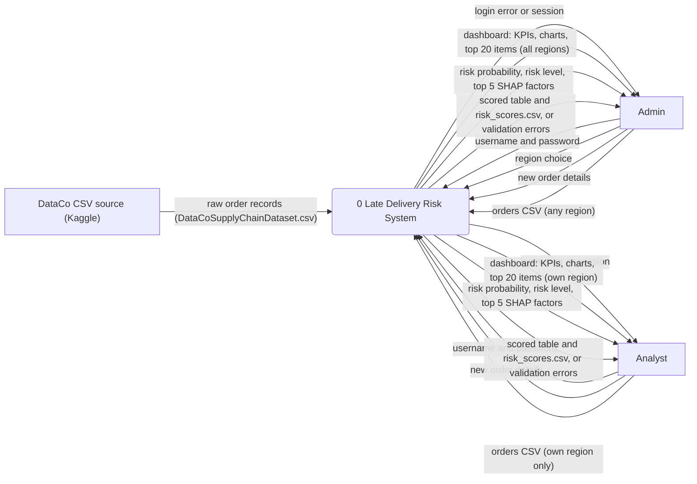
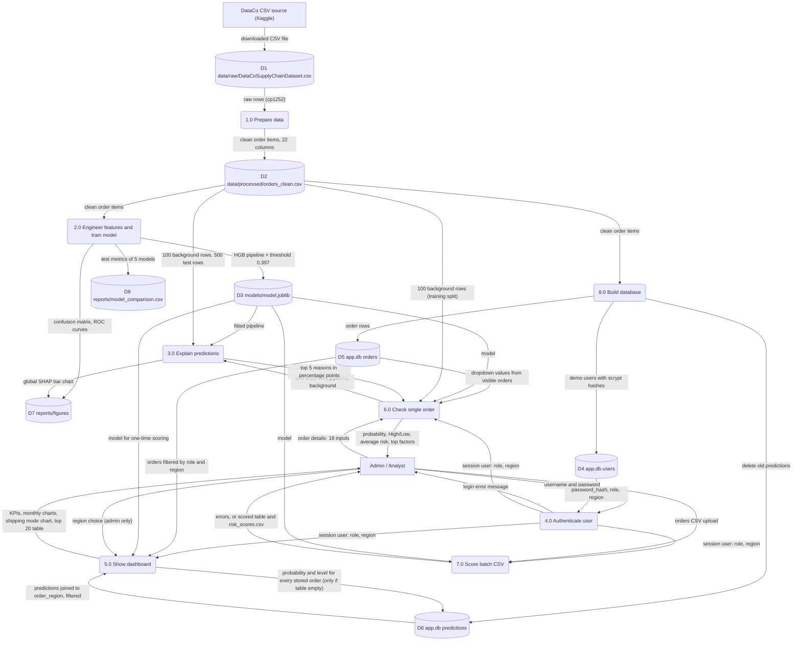

# Data Flow Diagrams (DFD Level 0 and Level 1)

Source of truth: `src/data_prep.py`, `src/features.py`, `src/train.py`, `src/explain.py`, `src/db.py` and `app.py`.
Notation: rectangles = external entities, rounded boxes = processes, cylinders = data stores, labelled arrows = data flows.

## DFD Level 0 (context diagram)

Note: the offline build scripts (`python -m src.data_prep`, `src.train`, `src.explain`, `src.db`) are run from the command line by whoever installs the system. The code has no role check on them, so no actor is attached to them in the diagrams.

| Element | Type | Description |
|---|---|---|
| Late Delivery Risk System | Process (0) | The whole system: data preparation, model training, SHAP explanations, SQLite database and the Streamlit app. Runs locally. |
| DataCo CSV source | External entity | The DataCo Smart Supply Chain dataset from Kaggle, saved as `data/raw/DataCoSupplyChainDataset.csv`. |
| Admin | External entity | User with role `admin`, region `All`. Sees every region and can narrow the dashboard to one region. |
| Analyst | External entity | User with role `analyst` and one assigned region (demo: Central America). Sees only that region; uploads with other regions are rejected. |
| Flows | Data flows | Login credentials, region choice (admin only), single-order inputs and CSV uploads go in; dashboard, risk results, SHAP factors, scored CSV and error messages come out. |

## DFD Level 1

Notes on the flows (from the code):

- Process 5.0: the one-time scoring (`ensure_predictions` in `app.py`) runs after login on whichever page is opened first, whenever the `predictions` table is empty. It is drawn under 5.0 because the dashboard is the only screen that reads `predictions`.
- Processes 6.0 and 7.0 do **not** write to D6. Single-order checks and batch results are shown and downloaded only, not saved.
- Process 7.0 drops a `late_delivery_risk` column if the upload contains one, so the actual outcome never reaches the model.
- Process 3.0 runs in two ways: offline (`python -m src.explain`, writes the global chart to D7) and online, called by 6.0 through `build_explainer` and `explain_order`.

| Element | Type | Description |
|---|---|---|
| DataCo CSV source | External entity | Kaggle dataset, downloaded by hand into `data/raw/`. |
| Admin / Analyst | External entity | App users. Admin: all regions plus region selector. Analyst: own region only. |
| 1.0 Prepare data | Process | `python -m src.data_prep`. Removes CANCELED and SUSPECTED_FRAUD orders, drops leakage, profit, personal, ID, duplicate and empty columns, strips text, renames to snake_case, parses `order_date`, drops zip-code `customer_state` rows, fails on missing values, saves D2. |
| 2.0 Engineer features and train model | Process | `python -m src.train` (uses `src/features.py`). Grouped stratified 80/20 split, two baselines, logistic regression, HistGradientBoosting with grid search, threshold tuning, test evaluation; saves D3, D7 figures 08 and 09, and D8. |
| 3.0 Explain predictions | Process | `src/explain.py`. shap PermutationExplainer on the probability of late, with an additivity check. Offline: global chart. Online: top 5 reasons for one order. |
| 8.0 Build database | Process | `python -m src.db`. Creates tables, clears predictions, reloads orders from D2, adds demo users if missing. |
| 4.0 Authenticate user | Process | Login form in `app.py`; `verify_user` checks the scrypt hash. Same error text for unknown user and wrong password. |
| 5.0 Show dashboard | Process | "Risk dashboard" page. Reads region-filtered orders and predictions; scores all stored orders once if D6 is empty. |
| 6.0 Check single order | Process | "Order risk checker" page. Scores one order and asks 3.0 for the top 5 SHAP factors. |
| 7.0 Score batch CSV | Process | "Batch scoring" page. Validates columns, types, ranges and region, then scores. Results are not saved. |
| D1 | Data store | Raw DataCo CSV (Windows-1252 encoding). |
| D2 | Data store | Clean order items, 22 columns. Also read at app run time for the SHAP background sample. |
| D3 | Data store | Saved model: `FixedThresholdClassifier(FrozenEstimator(pipeline))`, threshold 0.397. |
| D4 | Data store | `users` table: username, salted scrypt hash, role, region. |
| D5 | Data store | `orders` table: clean order items, indexed on `order_region`. |
| D6 | Data store | `predictions` table: order_item_id, risk_probability, risk_level, created_at (UTC). |
| D7 | Data store | Figures: `08_confusion_matrix.png`, `09_roc_curves.png`, `10_shap_global_importance.png` (figures 01 to 07 come from the EDA notebook, outside these processes). |
| D8 | Data store | Test-set comparison table of the five model rows. |
