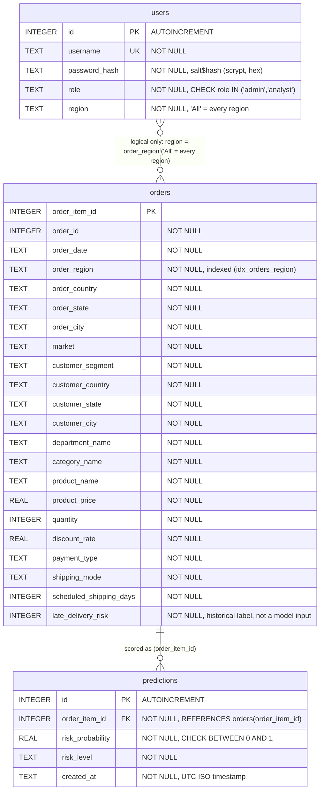

# Entity-Relationship Diagram: SQLite database (data/app.db)

Source of truth: the `SCHEMA` string in `src/db.py`.

Note: the dotted `users`-`orders` link is not a foreign key. It is applied in the query code (`get_orders`, `get_predictions` in `src/db.py`), not by the database.

## Constraints and contents

| Table | Constraints | Holds |
|---|---|---|
| users | PK `id` (AUTOINCREMENT); UNIQUE `username`; CHECK `role IN ('admin','analyst')`; all columns NOT NULL | Login accounts: username, salted scrypt password hash, role and assigned region (`'All'` for admin). |
| orders | PK `order_item_id`; index `idx_orders_region` on `order_region`; all columns NOT NULL | Cleaned order items loaded from `data/processed/orders_clean.csv`. `late_delivery_risk` is the historical outcome label, used only for the dashboard late-rate KPIs and never as a model input. |
| predictions | PK `id` (AUTOINCREMENT); FK `order_item_id` -> `orders(order_item_id)`; CHECK `risk_probability BETWEEN 0 AND 1`; all columns NOT NULL | Model scores saved by the app: probability, risk level and UTC timestamp for one order item. |

SQLite enforces the foreign key only because `get_connection()` runs `PRAGMA foreign_keys = ON`.
