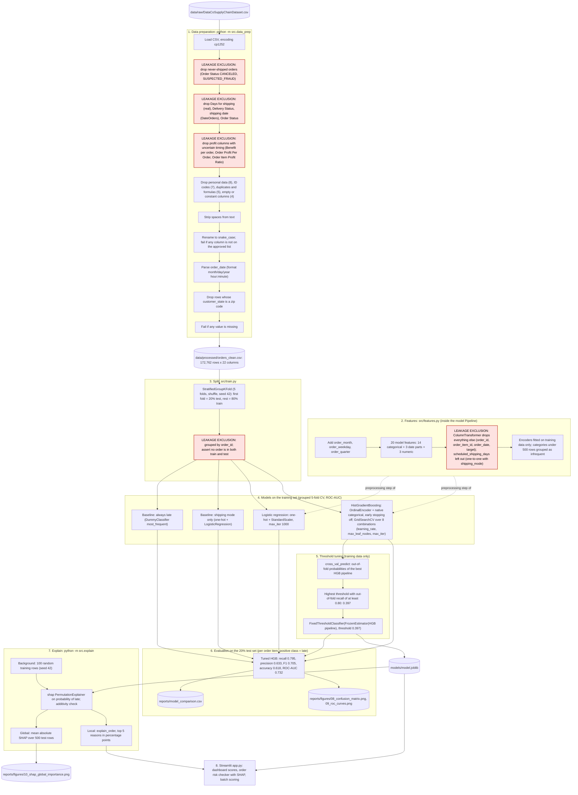

# ML Pipeline Flow

Source of truth: `src/data_prep.py`, `src/features.py`, `src/train.py`, `src/explain.py`, `app.py`; metrics from `reports/model_comparison.csv`.
Steps that exclude leakage are marked in red and labelled "LEAKAGE EXCLUSION".

## Test-set results (from `reports/model_comparison.csv`)

Each row is one order item. Threshold 0.5 unless stated. The CSV labels the tuned row "threshold 0.40" because it rounds to 2 decimals; the saved threshold is 0.397 (test TR-13).

| Model | CV ROC-AUC (mean) | CV ROC-AUC (std) | Accuracy | Precision | Recall | F1 | Test ROC-AUC |
|---|---|---|---|---|---|---|---|
| Always late (baseline) | 0.500 | 0.000 | 0.573 | 0.573 | 1.000 | 0.728 | 0.500 |
| Shipping mode only (baseline) | 0.742 | 0.004 | 0.695 | 0.883 | 0.539 | 0.670 | 0.739 |
| Logistic regression | 0.742 | 0.005 | 0.694 | 0.859 | 0.557 | 0.676 | 0.731 |
| HistGradientBoosting | 0.740 | 0.005 | 0.690 | 0.833 | 0.574 | 0.679 | 0.732 |
| HistGradientBoosting (threshold 0.397), saved model | 0.740 | 0.005 | 0.618 | 0.633 | 0.795 | 0.705 | 0.732 |

## Step notes

| Step | What the code does | File |
|---|---|---|
| 1 | Removes never-shipped orders and every column recorded after shipping or delivery, plus profit columns whose timing is uncertain. `rename_columns` raises an error if any column outside the approved list survives, so a new column cannot reach the model without review. | `src/data_prep.py` |
| 2 | Date parts are made from `order_date`; `order_date` itself, the IDs and the target are dropped by `remainder="drop"`. The whole step is part of the Pipeline, so encoders are fitted on training folds only. | `src/features.py` |
| 3 | All items of one order stay on the same side of the split and in the same CV fold. | `src/train.py` |
| 4 | HistGradientBoosting is saved although its CV ROC-AUC ties with logistic regression, because it keeps one column per feature and SHAP maps directly to features. The best grid settings are printed at run time, not stored in a file. | `src/train.py` |
| 5 | The threshold is chosen from out-of-fold training predictions, never from the test set. | `src/train.py` |
| 7 | TreeExplainer is not used: it gave values that did not add up for HistGradientBoosting's native categorical splits. | `src/explain.py` |
| 8 | The app loads `models/model.joblib`, rebuilds the same 100-row background from `orders_clean.csv`, and creates a fresh explainer for every checked order. | `app.py` |
