# PERT Chart: Project Schedule (Sep 27 to Oct 5, 2026)

Sources: activities, planned days and order from `docs/claude-code-playbook.md`; actual completion dates from `docs/ai-use-log.md` (as of 2026-09-30).

**All durations (o, m, p) are estimates.** The playbook gives only the planned day for each activity, not how long each one takes. Durations are in working days (1 day = one full working day; fractions are parts of a day).

Expected time: te = (o + 4m + p) / 6. ES/EF = earliest start/finish, LS/LF = latest start/finish, slack = LS - ES (all in days from the start of Sun Sep 27).

## Network diagram

Thick arrows and red boxes = critical path. Each box: ID, activity, te.

```mermaid
flowchart LR
    START(("Start Sep 27"))
    A["A Pivot and setup, te 0.54"]
    B["B Profile dataset, te 0.54"]
    C["C Data preparation + review + data dictionary, te 1.00"]
    D["D EDA notebook, te 0.54"]
    E["E Feature engineering + review, te 0.54"]
    F["F Model training + review, te 1.00"]
    G["G SHAP explanations, te 0.63"]
    H["H SQLite database, te 0.54"]
    I["I Review explain/db + ERD, te 0.29"]
    J["J Streamlit app + walkthrough, te 1.00"]
    K["K Tests + test report, te 1.00"]
    L["L Bug fixes + re-run tests, te 0.54"]
    M["M Documentation artifacts, te 0.54"]
    N["N Update requirements checklist, te 0.27"]
    O["O Update README, te 0.27"]
    P["P Viva practice, te 0.54"]
    Q["Q Final code review, te 0.29"]
    R["R Review report draft, te 0.54"]
    S["S Fresh clone test, te 0.27"]
    T["T Upload soft copy, te 0.13"]
    FINISH(("Final submission Mon Oct 5, 2026"))

    START ==> A
    A ==> B
    B ==> C
    C ==> D
    D ==> E
    E ==> F
    F ==> G
    C --> H
    G ==> I
    H --> I
    I ==> J
    J ==> K
    K ==> L
    L ==> M
    M ==> N
    L --> O
    M --> P
    L --> Q
    N ==> R
    O --> S
    Q --> S
    P --> T
    R ==> T
    S --> T
    T ==> FINISH

    classDef critical fill:#fde2e1,stroke:#c0392b,stroke-width:2px,color:#000
    class A,B,C,D,E,F,G,I,J,K,L,M,N,R,T critical
```

## Activity table

| ID | Activity (playbook prompt) | Predecessors | o | m | p | te | ES | EF | LS | LF | Slack | Critical | Planned day | Actual completion (ai-use-log) |
|---|---|---|---|---|---|---|---|---|---|---|---|---|---|---|
| A | Pivot to new topic, project setup, requirements checklist (1.1, 1.2) | - | 0.25 | 0.5 | 1 | 0.54 | 0.00 | 0.54 | 0.00 | 0.54 | 0.00 | Yes | Sun Sep 27 | 2026-09-27 |
| B | Download and profile dataset, classify columns (1.3) | A | 0.25 | 0.5 | 1 | 0.54 | 0.54 | 1.08 | 0.54 | 1.08 | 0.00 | Yes | Sun Sep 27 | 2026-09-27 |
| C | src/data_prep.py, code review, data dictionary (1.4, 1.5) | B | 0.5 | 1 | 1.5 | 1.00 | 1.08 | 2.08 | 1.08 | 2.08 | 0.00 | Yes | Sun Sep 27 | 2026-09-27 |
| D | EDA notebook, 7 charts (2.1) | C | 0.25 | 0.5 | 1 | 0.54 | 2.08 | 2.62 | 2.08 | 2.62 | 0.00 | Yes | Mon Sep 28 | 2026-09-27 |
| E | src/features.py and leakage review (2.2, 2.3) | D | 0.25 | 0.5 | 1 | 0.54 | 2.62 | 3.16 | 2.62 | 3.16 | 0.00 | Yes | Mon Sep 28 | 2026-09-27 |
| F | Model concepts, src/train.py, review (3.1 to 3.3) | E | 0.5 | 1 | 1.5 | 1.00 | 3.16 | 4.16 | 3.16 | 4.16 | 0.00 | Yes | Tue Sep 29 | 2026-09-27 (re-run in .venv 2026-09-28) |
| G | SHAP explanations, src/explain.py (4.1) | F | 0.25 | 0.5 | 1.5 | 0.63 | 4.16 | 4.79 | 4.16 | 4.79 | 0.00 | Yes | Wed Sep 30 | 2026-09-28 |
| H | SQLite database, src/db.py (4.2) | C | 0.25 | 0.5 | 1 | 0.54 | 2.08 | 2.62 | 4.25 | 4.79 | 2.17 | No | Wed Sep 30 | 2026-09-28 |
| I | Review of explain.py and db.py, ERD (4.3) | G, H | 0.25 | 0.25 | 0.5 | 0.29 | 4.79 | 5.08 | 4.79 | 5.08 | 0.00 | Yes | Wed Sep 30 | 2026-09-28 |
| J | Streamlit app.py and walkthrough (5.1, 5.2) | I | 0.5 | 1 | 1.5 | 1.00 | 5.08 | 6.08 | 5.08 | 6.08 | 0.00 | Yes | Thu Oct 1 | 2026-09-28 (5.1); 5.2 not logged |
| K | Tests and test report (6.1) | J | 0.5 | 1 | 1.5 | 1.00 | 6.08 | 7.08 | 6.08 | 7.08 | 0.00 | Yes | Fri Oct 2 | 2026-09-28 |
| L | Fix reported bugs, re-run tests (6.2) | K | 0.25 | 0.5 | 1 | 0.54 | 7.08 | 7.62 | 7.08 | 7.62 | 0.00 | Yes | Fri Oct 2 | 2026-09-30 |
| M | Documentation artifacts: DFD, architecture, ML pipeline, PERT, user manual, hardware/software (7.1) | L | 0.25 | 0.5 | 1 | 0.54 | 7.62 | 8.16 | 7.62 | 8.16 | 0.00 | Yes | Sat Oct 3 | In progress 2026-09-30 (not yet logged) |
| N | Update requirements checklist (7.2) | M | 0.1 | 0.25 | 0.5 | 0.27 | 8.16 | 8.43 | 8.16 | 8.43 | 0.00 | Yes | Sat Oct 3 | Not yet |
| O | Update README (7.3) | L | 0.1 | 0.25 | 0.5 | 0.27 | 7.62 | 7.89 | 8.43 | 8.70 | 0.81 | No | Sat Oct 3 | Not yet |
| P | Viva practice (8.1) | M | 0.25 | 0.5 | 1 | 0.54 | 8.16 | 8.70 | 8.43 | 8.97 | 0.27 | No | Sun Oct 4 | Not yet |
| Q | Final code review of the repo (8.2) | L | 0.25 | 0.25 | 0.5 | 0.29 | 7.62 | 7.91 | 8.41 | 8.70 | 0.79 | No | Sun Oct 4 | Not yet |
| R | Review report draft against checklist (8.3) | N | 0.25 | 0.5 | 1 | 0.54 | 8.43 | 8.97 | 8.43 | 8.97 | 0.00 | Yes | Sun Oct 4 | Not yet |
| S | Fresh clone test (Day 9) | O, Q | 0.1 | 0.25 | 0.5 | 0.27 | 7.91 | 8.18 | 8.70 | 8.97 | 0.79 | No | Mon Oct 5 | Not yet |
| T | Upload soft copy, final submission (Day 9) | P, R, S | 0.1 | 0.1 | 0.25 | 0.13 | 8.97 | 9.10 | 8.97 | 9.10 | 0.00 | Yes | Mon Oct 5 | Not yet |

te values are rounded to 2 decimals; ES/EF/LS/LF are computed from the rounded te values.

## Critical path

A -> B -> C -> D -> E -> F -> G -> I -> J -> K -> L -> M -> N -> R -> T

Expected length: 0.54 + 0.54 + 1.00 + 0.54 + 0.54 + 1.00 + 0.63 + 0.29 + 1.00 + 1.00 + 0.54 + 0.54 + 0.27 + 0.54 + 0.13 = **9.10 days**.

Notes:

- The planned window (Sun Sep 27 to Mon Oct 5) is 9 calendar days, so on these estimates the plan has no slack on the critical path; a slip in any critical activity would push the submission.
- Actual progress is ahead of plan: activities A to L were finished by 2026-09-30 (planned finish of L: Fri Oct 2).
- Dependencies are taken from the playbook order and from what each module needs: H (database) only needs the clean CSV from C, so it has slack; D -> E is kept because `src/features.py` excludes `scheduled_shipping_days` based on EDA charts 2 and 7; R (report review) follows N because the review is done against the updated checklist.
- The playbook's daily "End of every day" step (summary, ai-use-log, commit message) and the student's daily report writing are not modelled as separate activities.
