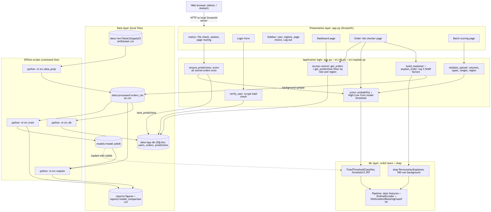
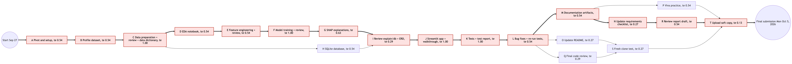
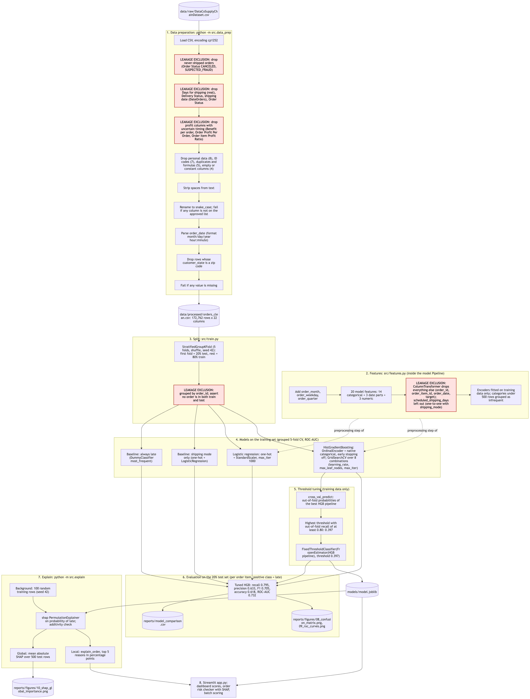
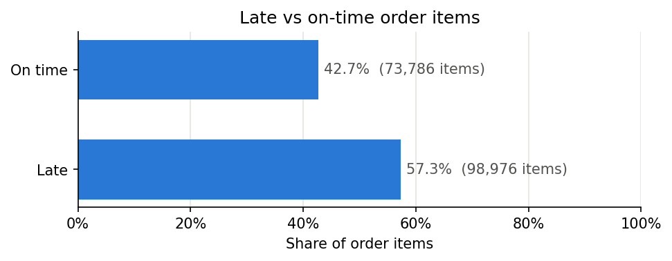
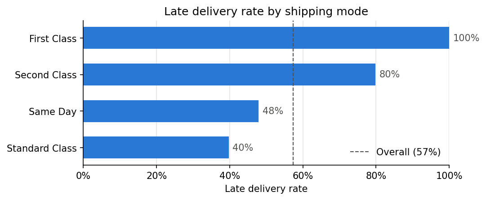
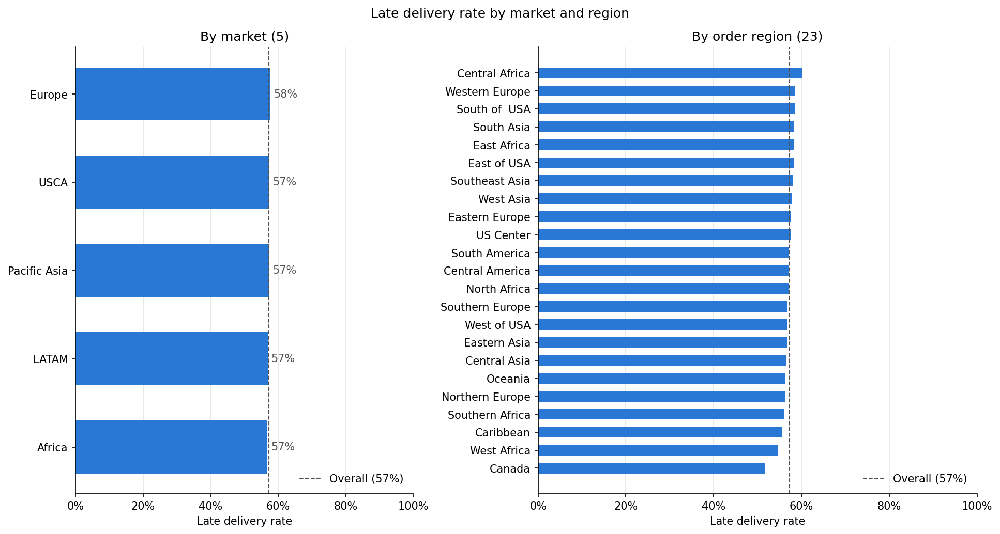
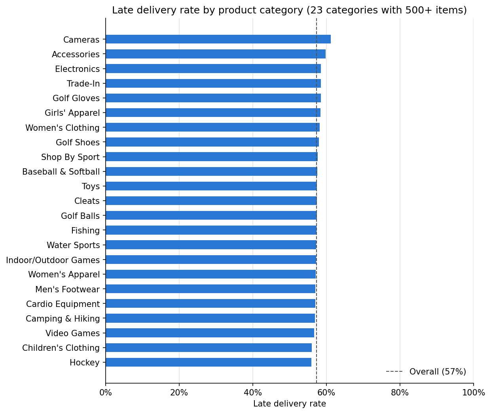
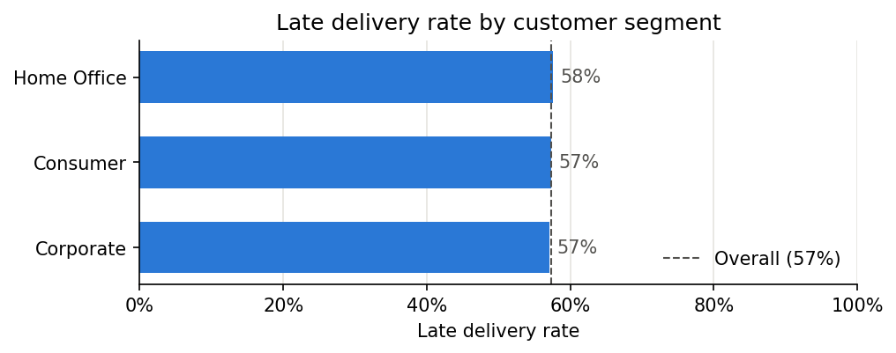
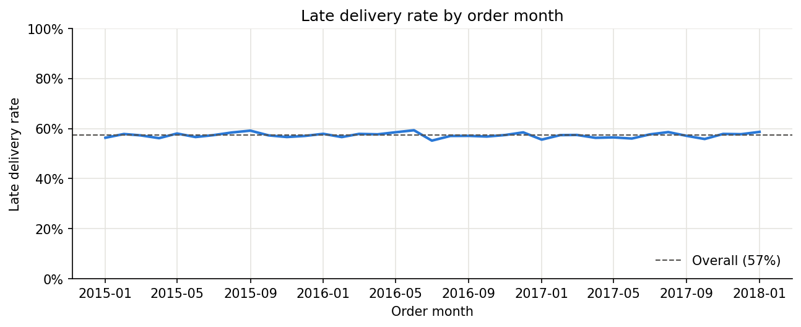
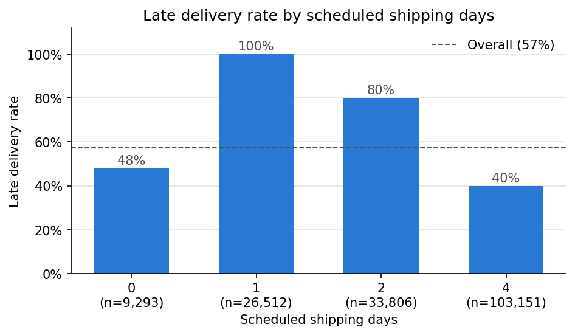

# Part 2: System Analysis, Design, Planning and Implementation

<!--
Draft generated from repository facts (code, docs/, reports/, docs/ai-use-log.md) on 2026-09-30.
Every [FILL: ...] marker must be completed by the student before submission.
Numbers are taken from the code, reports/model_comparison.csv, docs/diagrams/pert.md,
docs/test-report.md and direct runs of the project code in the project .venv.
-->

---

## 4. System Analysis and Design vis-a-vis User Requirements

### 4.1 Users and Their Requirements

The system has two kinds of users, both from logistics operations:

- **Analyst:** responsible for one region. In the demo setup the analyst is assigned Central America, the largest region, with 27,174 order items.
- **Admin:** oversees all regions.

The analyst needs to see the late-delivery picture for their own region, check the risk of a new order before it ships, understand *why* an order is risky, and score a file of orders at once. The admin needs the same functions for any region. Both must log in, and neither may see more than their role allows.

From these needs and the project scope, I derived the requirements below. Each one is traced to the part of the system that meets it.

**Table 4.1: Functional requirements**

| ID | Requirement | Met by |
|---|---|---|
| FR1 | Users log in with a username and password; wrong credentials are rejected | `app.py` `show_login`, `src/db.py` `verify_user` |
| FR2 | A risk dashboard shows KPIs, trends and the highest-risk orders for the user's allowed regions | `app.py` `show_dashboard`, `src/db.py` `get_orders`, `get_predictions` |
| FR3 | A user can describe one new order and get the probability of late delivery, a risk level and the top 5 reasons | `app.py` `show_checker`, `score`, `src/explain.py` `explain_order` |
| FR4 | A user can upload a CSV of orders, have it validated, see the scores and download them | `app.py` `show_batch`, `validate_upload`, `score` |
| FR5 | Admins see all regions; analysts see and score only their own region | `src/db.py` `get_orders`, `get_predictions` (filter by role in SQL); `app.py` `validate_upload` (region check) |
| FR6 | Predictions for stored orders are saved in the database | `app.py` `ensure_predictions`, `src/db.py` `save_predictions` |
| FR7 | The data can be rebuilt and the model retrained from the raw dataset with documented commands | `python -m src.data_prep`, `src.train`, `src.explain`, `src.db`; `docs/setup.md` |

**Table 4.2: Non-functional requirements**

| ID | Requirement | How it is met |
|---|---|---|
| NFR1 | **No data leakage:** only information known when the order is placed is used | Leakage columns are dropped in `src/data_prep.py`; the feature list in `src/features.py` excludes IDs, the target and `scheduled_shipping_days`; the split is grouped by order; tests FE-04, DP-02 and DP-19 check this |
| NFR2 | **Business-aligned decisions:** catch most late deliveries | Threshold chosen for out-of-fold recall of at least 0.80 (0.397); test recall 0.795 |
| NFR3 | **Explainability:** every single-order prediction comes with readable reasons | SHAP PermutationExplainer; reasons in percentage points; additivity checked in code |
| NFR4 | **Security** | scrypt password hashes with a random salt, constant-time comparison, a dummy hash for unknown users, parameterized SQL, role-based filtering, upload validation |
| NFR5 | **Local operation:** no external services | All components run on one machine; no external APIs or LLMs |
| NFR6 | **Usability:** clear screens and messages | Linked drop-downs, plain-language error messages, the same login error for every failure, a sample CSV (`docs/sample_batch.csv`) |
| NFR7 | **Testability and maintainability** | 107 automated pytest tests; pinned library versions in `requirements.txt`; one module per concern |
| NFR8 | **Performance** acceptable on a laptop | Scoring all 172,762 stored orders took about 0.9 s and one SHAP explanation about 3 s (measured on 2026-09-28) |

### 4.2 Analysis of the Existing Situation

Without the system, late deliveries are known only after they happen: the delivery status and the actual shipping days are recorded after shipping. The raw dataset contains exactly these after-the-fact columns. Using them would produce a model that looks very accurate but cannot be used at order time. The analysis therefore had two parts:

1. Separate the information available when an order is placed from the information recorded later.
2. Design a system that works only with the first.

The column-by-column analysis of all 53 raw columns is in the data dictionary (Annexure 2). In summary:

| Classification | Columns |
|---|---|
| Model features (19 raw columns, giving 20 features after the date parts are derived) | 19 |
| Target | 1 |
| Keys (not features) | 2 |
| Excluded as leakage | 4 |
| Excluded as leakage with uncertain timing (the profit columns) | 3 |
| Dropped as personal data | 8 |
| Dropped as redundant IDs | 7 |
| Dropped as duplicates | 5 |
| Dropped as carrying no information | 4 |

### 4.3 System Architecture

The system is organised in four layers plus a set of offline build scripts (Figure [FILL: number]).

- **Presentation layer (`app.py`, Streamlit):** the login form, a sidebar (user, role, regions, page choice, Log out) and three pages: Dashboard, Order risk checker and Batch scoring.
- **Application logic:**
  - authentication (`verify_user`, `check_password`)
  - access control (`get_orders`, `get_predictions`, and the region check in `validate_upload`)
  - upload validation (`validate_upload`)
  - scoring (`score`, `ensure_predictions`)
  - the SHAP explainer (`build_explainer`, `explain_order`)
- **ML layer:** the saved model `models/model.joblib`. It is a `FixedThresholdClassifier` with threshold 0.397, wrapping the frozen scikit-learn pipeline (date features, ordinal encoding, `HistGradientBoostingClassifier`). The SHAP `PermutationExplainer` uses 100 training rows as background.
- **Data layer:**
  - the SQLite database `data/app.db` (users, orders, predictions)
  - the clean CSV `data/processed/orders_clean.csv`
  - the model file
  - the figures and comparison table in `reports/`
- **Offline scripts:** `python -m src.data_prep`, `src.train`, `src.explain` and `src.db` build the data, model, figures and database. Each has a `main()` function and is run from the project root.

**Design decisions:**

| Decision | Reason |
|---|---|
| Separate modules for data preparation, features, training, explanation and database | Each can be run, reviewed and tested on its own |
| All preprocessing inside the scikit-learn Pipeline | It is fitted on training data only and applied identically at prediction time |
| The model saved with its threshold (`FixedThresholdClassifier`) | The application uses exactly the decision rule chosen during training |
| The region filter applied inside the SQL query and decided by role | An analyst's screens never receive other regions' data |
| One database connection per request | SQLite connections cannot be shared across Streamlit's threads |
| A fresh SHAP explainer for each explanation | The same order always gets the same explanation; building one takes about 0.02 s |

### 4.4 Data Design

The database design is shown in the ERD (section 10.2, Figure [FILL: number]). It has three tables:

- **users:** unique username, salted password hash, role (`admin` or `analyst`), region.
- **orders:** the clean order items, with `order_item_id` as the primary key and an index on `order_region`.
- **predictions:** probability, risk level and timestamp. A foreign key links each prediction to its order.

`order_item_id` is used as the key rather than `order_id`, because one order can contain several items; 172,762 items belong to 62,894 orders. The detailed data dictionary is Annexure 2.

### 4.5 Screen Design

The four screens (login, dashboard, order risk checker, batch scoring) and their inputs and outputs are described with screenshots in section 10.4.

---

## 5. System Planning (PERT Chart)

### 5.1 Planning Approach

I planned the project as a sequence of activities, one module at a time, following a day-by-day plan (`docs/claude-code-playbook.md`) for the window Sunday 27 September to Monday 5 October 2026. For each activity I estimated three durations in days: optimistic (o), most likely (m) and pessimistic (p). From these I computed the PERT expected time:

te = (o + 4m + p) / 6

I then derived the earliest and latest start and finish times, the slack of each activity and the critical path.

**Figure [FILL: number]: PERT chart** (critical activities highlighted)

**Table 5.1: PERT activities** (source: `docs/diagrams/pert.md`; durations are estimates in days)

| ID | Activity | Predecessors | o | m | p | te | Slack | Critical |
|---|---|---|---|---|---|---|---|---|
| A | Project setup and requirements checklist | - | 0.25 | 0.5 | 1 | 0.54 | 0.00 | Yes |
| B | Download and profile the dataset, classify columns | A | 0.25 | 0.5 | 1 | 0.54 | 0.00 | Yes |
| C | Data preparation, code review, data dictionary | B | 0.5 | 1 | 1.5 | 1.00 | 0.00 | Yes |
| D | EDA notebook (7 charts) | C | 0.25 | 0.5 | 1 | 0.54 | 0.00 | Yes |
| E | Feature engineering and leakage review | D | 0.25 | 0.5 | 1 | 0.54 | 0.00 | Yes |
| F | Model training and review | E | 0.5 | 1 | 1.5 | 1.00 | 0.00 | Yes |
| G | SHAP explanations | F | 0.25 | 0.5 | 1.5 | 0.63 | 0.00 | Yes |
| H | SQLite database | C | 0.25 | 0.5 | 1 | 0.54 | 2.17 | No |
| I | Review of explanation and database modules, ERD | G, H | 0.25 | 0.25 | 0.5 | 0.29 | 0.00 | Yes |
| J | Streamlit application | I | 0.5 | 1 | 1.5 | 1.00 | 0.00 | Yes |
| K | Tests and test report | J | 0.5 | 1 | 1.5 | 1.00 | 0.00 | Yes |
| L | Fix reported defects, re-run tests | K | 0.25 | 0.5 | 1 | 0.54 | 0.00 | Yes |
| M | Documentation: DFD, architecture, ML pipeline, PERT, user manual, hardware/software | L | 0.25 | 0.5 | 1 | 0.54 | 0.00 | Yes |
| N | Update requirements checklist | M | 0.1 | 0.25 | 0.5 | 0.27 | 0.00 | Yes |
| O | Update README | L | 0.1 | 0.25 | 0.5 | 0.27 | 0.81 | No |
| P | Viva practice | M | 0.25 | 0.5 | 1 | 0.54 | 0.27 | No |
| Q | Final code review | L | 0.25 | 0.25 | 0.5 | 0.29 | 0.79 | No |
| R | Review report draft against the checklist | N | 0.25 | 0.5 | 1 | 0.54 | 0.00 | Yes |
| S | Fresh clone test | O, Q | 0.1 | 0.25 | 0.5 | 0.27 | 0.79 | No |
| T | Upload soft copy, final submission | P, R, S | 0.1 | 0.1 | 0.25 | 0.13 | 0.00 | Yes |

**Critical path:** A → B → C → D → E → F → G → I → J → K → L → M → N → R → T, with an expected length of **9.10 days**. The planned window was 9 calendar days, so the plan had no slack on the critical path.

Two dependencies are worth explaining:

- **H has slack of 2.17 days.** The database only needs the clean data (C), not the model.
- **E follows D.** The decision to exclude `scheduled_shipping_days` from the features came from the EDA: it maps one-to-one to the shipping mode.

### 5.2 Planned versus Actual Progress

Work went faster than planned. According to `docs/ai-use-log.md`:

- **Activities A to F:** finished on 27 September.
- **Activities G to K:** finished on 28 September. The model was also re-run in the project environment with the pinned library versions that day.
- **Activity L (defect fixes):** 30 September.
- **Activities M, N, O and S:** 30 September. These are the documentation, the checklist, the README and the fresh clone test.

The submission date was later moved forward from 5 October to **1 October 2026**. The PERT chart above shows the original plan. The remaining activities were:

- viva practice (P)
- the final code review (Q) [FILL: completed or not, and date]
- the review of this report against the checklist (R)
- submission (T)

[FILL: dates on which P, Q, R and T were completed]

---

## 6. Process Logic of Each Module

Figure [FILL: number] shows the complete process, from the raw data to the application. The leakage-control steps are highlighted. This section describes the logic of each module in the order in which the process runs; it also serves as the description of the process involved.

### 6.1 Data Preparation (`src/data_prep.py`)

**Input:** `data/raw/DataCoSupplyChainDataset.csv`, which has 180,519 rows and 53 columns and is Windows-1252 encoded.

**Output:** `data/processed/orders_clean.csv`, which has 172,762 rows, 22 columns and no missing values.

**Steps:**

1. **Load** the file with the `cp1252` encoding. Latin-1 would garble place names such as "Šiauliai".
2. **Remove orders that never shipped.** These are the 7,754 rows whose order status is CANCELED or SUSPECTED_FRAUD; their "not late" label is meaningless.
3. **Drop columns.** The script checks that every expected column is present before dropping anything. It drops:
   - 4 leakage columns: actual shipping days, delivery status, shipping date, order status
   - 3 profit columns whose timing is uncertain
   - 8 personal-data or precise-location columns
   - 7 redundant identifier codes
   - 5 duplicate or formula columns
   - 4 columns that carry no information
4. **Strip spaces** from all text values.
5. **Rename the columns to snake_case.** The script stops with an error if any column is not on the approved list, so a leakage column cannot slip through.
6. **Remove the 3 rows** whose customer state is a zip code; these rows are shifted in the source.
7. **Parse the order date** with the explicit format month/day/year hour:minute.
8. **Check for missing values.** The script stops if any value is missing.
9. **Save** the clean CSV.

**Exploratory data analysis** (`notebooks/01_eda.ipynb`, Figures [FILL: numbers]). The EDA shows that the late rate is almost the same across most dimensions:

- **Markets:** from 56.8% (Africa) to 57.7% (Europe).
- **Customer segments:** from 57.1% to 57.6%.
- **Order months:** from 56.7% to 58.0%.
- **Product categories** with at least 500 items: from 56.0% to 61.2%.
- **Order regions:** from 51.6% (Canada) to 60.1% (Central Africa).

Only the shipping mode separates the classes clearly. Its late rates are:

| Shipping mode | Late rate |
|---|---|
| First Class | 100% |
| Second Class | 79.8% |
| Same Day | 47.9% |
| Standard Class | 39.8% |

The scheduled shipping days map one-to-one to the shipping mode: 0 days for Same Day, 1 for First Class, 2 for Second Class and 4 for Standard Class.

[FILL: my interpretation of the EDA charts, if I want to add more than the facts above; the interpretation cells in the notebook are empty]

### 6.2 Feature Engineering (`src/features.py`)

**Input:** clean order items. **Output:** a preprocessing step for each model type. It is not fitted here; it is fitted inside the model pipeline on training data only.

**Steps:**

1. `add_date_features` adds `order_month`, `order_weekday` (0 = Monday) and `order_quarter` from the order date. These date parts are treated as categories, because month 12 is not "more" than month 1.
2. `get_feature_lists` returns the **20 model features**:
   - 14 categorical: payment type, shipping mode, customer segment, customer country, state and city, market, order region, country, state and city, category, department, product
   - 3 date parts
   - 3 numeric: product price, quantity, discount rate

   `scheduled_shipping_days` is left out because it is one-to-one with the shipping mode.
3. `build_preprocessor` prepares the features differently for each model:
   - **Logistic regression:** one-hot encoding of the categories, plus scaling of the numbers to zero mean and unit variance.
   - **HistGradientBoosting:** one integer code per category (ordinal encoding), read by the model's native categorical support, with the numbers passed through unchanged.

   In both cases, categories seen fewer than 500 times in training are grouped as "infrequent". This keeps high-cardinality columns small (for example, 3,585 order cities) and below HistGradientBoosting's limit of 255 categories per feature. A category not seen in training is encoded as -1, which the tree model treats as missing.
4. `remainder="drop"` removes every other column (order ID, order item ID, order date, target), so none of them can reach the model.

### 6.3 Model Training and Selection (`src/train.py`)

**Input:** clean order items. **Outputs:**
- `models/model.joblib`
- `reports/model_comparison.csv`
- `reports/figures/08_confusion_matrix.png` and `09_roc_curves.png`

**Steps:**

1. **Split.** `split_train_test` uses `StratifiedGroupKFold` (5 folds, shuffled, seed 42) grouped by `order_id`. It takes the first fold as the 20% test set and asserts that no order is in both sets. The result is 138,209 training items and 34,553 test items, both with a late rate of 57.3%.
2. **Baselines:**
   - "always late" (`DummyClassifier` predicting the most frequent class)
   - "shipping mode only" (one-hot shipping mode plus logistic regression)
3. **Logistic regression:** the one-hot and scaling preprocessor, with `max_iter=1000`.
4. **HistGradientBoosting:** the ordinal preprocessor and native categorical features.
   - Early stopping is switched off, because it would hold out a random 10% of training rows that is not grouped by order. The number of iterations is tuned instead.
   - `GridSearchCV` tries 8 combinations: learning rate 0.05 or 0.1, maximum leaf nodes 15 or 31, and 200 or 400 iterations. It uses order-grouped 5-fold CV on ROC-AUC.
   - Selected: learning rate 0.1, 15 leaf nodes, 200 iterations.
5. **Cross-validated scores:** every candidate is scored with the same grouped 5-fold CV (ROC-AUC mean and standard deviation).
6. **Threshold.** `choose_threshold` computes out-of-fold probabilities of the tuned pipeline with `cross_val_predict`. It picks the highest threshold at which recall is at least 0.80 (`TARGET_RECALL`), which is **0.397**. The script stops with an error if no threshold reaches the target.
7. **Save.** The pipeline is frozen (`FrozenEstimator`) and wrapped in `FixedThresholdClassifier` with this threshold, then saved with joblib.
8. **Evaluate** every model on the test set: accuracy, precision, recall, F1, ROC-AUC. The script saves the comparison table, the confusion matrix and the ROC curves. The results are in section 8.

### 6.4 Explanation (`src/explain.py`)

**Input:** the saved model and clean order items. **Outputs:** `reports/figures/10_shap_global_importance.png`, and plain-language reasons for any single order.

**Steps:**

1. `load_pipeline` takes the inner pipeline from the saved model (`model.estimator_.estimator`).
2. `build_explainer` creates a `shap.PermutationExplainer` on the predicted probability of "late". It uses an `Independent` masker over 100 training rows and seed 42.
3. `shap_values_for` computes the SHAP values. It then checks **additivity**: the baseline plus the sum of the SHAP values must equal the predicted probability, within 1e-6. It raises an error otherwise.
4. `explain_order` sorts one order's contributions by size and keeps the top 5, dropping features with an effect of exactly zero. It then writes each one as a sentence, for example: "Shipping mode 'First Class' increased risk by 41.8 percentage points".
   - Month, weekday and quarter are shown as names, such as "January" or "Q1".
   - A value that was grouped as rare in training is flagged as such.
5. `save_global_summary` plots the mean absolute SHAP value per feature over 500 test items.

### 6.5 Database (`src/db.py`)

**Input:** the clean CSV and, optionally, the environment variables for the demo passwords. **Output:** `data/app.db`.

**Logic:**

1. `init_db` creates the three tables with their constraints:
   - unique username
   - role CHECK (`admin` or `analyst`)
   - probability CHECK (between 0 and 1)
   - foreign key from predictions to orders
   - an index on `order_region`

   `get_connection` switches on foreign-key enforcement.
2. `load_orders` clears predictions and orders, then inserts all 172,762 clean rows.
3. **Passwords:**
   - `hash_password` creates a random 16-byte salt and stores `salt$hash`, computed with scrypt (n = 2^14, r = 8, p = 1).
   - `check_password` re-hashes with the stored salt and compares in constant time (`hmac.compare_digest`).
   - `verify_user` checks unknown usernames against a dummy hash, so the response time does not reveal which usernames exist.
4. `create_demo_users` adds `admin` (all regions) and `analyst` (Central America) if they are missing. The passwords come from environment variables, and the script prints a warning when the defaults are used.
5. `get_orders` and `get_predictions` return every region for the `admin` role. For any other role they add `WHERE order_region = ?`. Access is decided by role, so a non-admin whose region is "All" sees nothing.
6. `save_predictions` inserts many predictions in one transaction. If any row fails, the whole batch is rolled back.
7. Every query uses `?` placeholders; no SQL is built from user input.

### 6.6 Application (`app.py`)

**Startup:** `main` checks that the clean CSV, the model and the database exist. If any is missing, it names the missing files and lists the commands to build them. It then shows the login form, or the pages if a user is logged in.

**Login:** `show_login` calls `verify_user`. On success the user record (username, role, region) is stored in the Streamlit session. On failure the page shows "Wrong username or password."

**One-time scoring:** `ensure_predictions` runs after login. If the predictions table is empty, for example after a fresh database build, it scores all stored orders and saves them with `save_predictions`.

**Dashboard (`show_dashboard`):**
- It loads the user's orders and predictions through the role-filtered queries.
- Admins can narrow the view to one region.
- It shows four KPIs, monthly order items and late rate (missing months appear as gaps), the actual late rate against the predicted risk by shipping mode, and the 20 highest-risk items.
- A caption notes that the predictions include training orders.

**Order risk checker (`show_checker`):**
- The drop-downs are linked (region → country → state → city, and so on), so only realistic combinations can be chosen. The market is derived from the region.
- On **Check risk**, the order is scored. The page shows:
  - the probability and the High/Low level, where High means a probability of at least 0.397
  - the background average
  - the top 5 SHAP reasons, from a freshly built explainer

**Batch scoring (`show_batch`, `validate_upload`):**
1. The uploaded CSV is read.
2. The 18 required columns must be present and the file must not be empty.
3. The `late_delivery_risk` column is dropped if present.
4. Dates and numbers are converted. Infinite numbers count as invalid.
5. The file is rejected if any of the following is true:
   - a value is missing or invalid
   - a quantity is not a whole number of at least 1
   - a price is negative
   - a discount is outside 0 to 1
   - for an analyst, a row is outside their region
6. Valid files are scored. The results are shown sorted by risk and offered as a CSV download. They are not saved.

**Caching and connections:** the model and the SHAP background sample are loaded once per application process. Orders are cached per role and region. Each database read opens and closes its own connection.

---

## 7. Methodology Adopted, System Implementation and Details of Hardware and Software

### 7.1 Methodology Adopted

I followed an **iterative, module-by-module** method with a review step after each module:

1. **Plan.** Before each task, write a short plan and confirm the approach.
2. **Build.** Write the module and run it on the real data in the project environment.
3. **Review.** A code review looks for bugs, data leakage, security issues and readability. I decided which findings to fix, and the fixes were applied before moving on.
4. **Test.** Add automated tests, and turn every defect found into a test.
5. **Record.** Record the task, the tool used and what I reviewed or changed in `docs/ai-use-log.md`.

The modelling itself follows the standard supervised-learning process:

- data understanding and preparation
- exploratory analysis
- feature engineering
- a grouped train/test split
- baselines
- model training with cross-validation
- threshold selection
- evaluation on an untouched test set
- explanation
- deployment in an application

Development was assisted by an AI coding assistant, Claude Code. It was used for writing and reviewing code, for writing tests, and for documentation (diagrams, data dictionary, test report, user manual). I reviewed and ran all code and made the design decisions, including the leakage-free feature list, the model choice and the threshold. Every significant AI-assisted task is recorded in `docs/ai-use-log.md`.

Several rules governed the project, recorded in the project instructions (`CLAUDE.md`):

- use only features known at order time
- store passwords only as hashes
- use parameterized SQL only
- validate uploaded files
- add no library without approval
- run everything locally

### 7.2 System Implementation

**Code organisation:**

| File | Lines | Purpose |
|---|---|---|
| `src/data_prep.py` | 201 | Cleaning and leakage removal |
| `src/features.py` | 93 | Feature list and preprocessing |
| `src/train.py` | 239 | Split, models, threshold, evaluation |
| `src/explain.py` | 166 | SHAP explanations |
| `src/db.py` | 256 | SQLite database |
| `app.py` | 349 | Streamlit application |
| `tests/` | [FILL: optional, total test lines] | 107 pytest tests |

The full code is in the code annexure.

**Build and run commands** (from the project root; full guide in `docs/setup.md`):

1. `python3.12 -m venv .venv`, then `.venv/bin/pip install -r requirements.txt`
2. Place `DataCoSupplyChainDataset.csv` in `data/raw/`
3. `.venv/bin/python -m src.data_prep`
4. `.venv/bin/python -m src.train`
5. `.venv/bin/python -m src.explain` (optional; global SHAP figure)
6. `.venv/bin/python -m src.db`
7. `.venv/bin/streamlit run app.py`, which opens at `http://localhost:8501`
8. `.venv/bin/python -m pytest`

**Implementation verification: fresh clone test.** On 30 September 2026 I cloned the repository into an empty folder and followed `docs/setup.md` exactly: new virtual environment, package installation, dataset, the four build scripts, the tests and the application. The results were:

- **Data preparation:** a clean CSV byte-identical to the original.
- **Training:** about 4 minutes, with the same threshold (0.397) and a model comparison table identical to the original.
- **Tests:** the first run showed that 3 login tests could not run on a freshly built database. They opened the database read-only, but the application saves its predictions at the first login. The tests were changed to use a private copy of the database, after which all 107 tests passed.
- **Application:** it started, and the first login scored and saved all 172,762 orders.

**Run times measured during the fresh clone test** (on the development machine):

| Step | Time |
|---|---|
| Package installation | about 25 s |
| Data preparation | about 10 s |
| Training | about 4 min |
| Global SHAP explanation | about 2.5 min |
| Database build | a few seconds |
| Test suite | about 11–16 s |

### 7.3 Hardware Used

| Item | Details |
|---|---|
| Machine | Apple Mac, [FILL: model] |
| Operating system | macOS (kernel Darwin 27.0.0) |
| Processor | [FILL: CPU] |
| Memory | [FILL: RAM] |
| Storage | [FILL: free disk space] |
| GPU | Not used; all training and scoring run on the CPU |

Minimum and recommended requirements are estimates, not measured values. They are listed in `docs/hardware-software.md`: at least a 64-bit dual-core CPU, 4 GB RAM and 2 GB free disk; a quad-core CPU and 8 GB RAM or more are recommended.

### 7.4 Software Used

| Software | Version | Purpose |
|---|---|---|
| macOS | Darwin 27.0.0 | Operating system |
| Python | 3.12.6 | Programming language |
| pandas | 3.0.6 | Data loading, cleaning and filtering |
| NumPy | 2.5.3 | Numerical arrays |
| scikit-learn | 1.9.1 | Pipeline, encoders, LogisticRegression, HistGradientBoostingClassifier, StratifiedGroupKFold, GridSearchCV, FixedThresholdClassifier, metrics |
| SHAP | 0.52.0 | PermutationExplainer for global and local explanations |
| Matplotlib | 3.11.2 | Charts saved to `reports/figures/` |
| joblib | 1.6.0 | Saving and loading the model |
| SQLite (Python `sqlite3`) | standard library | Database |
| Streamlit | 1.64.0 | Web application; `AppTest` for application tests |
| pytest | 9.1.1 | Automated testing |
| Jupyter | [FILL: version] | EDA notebook |
| Git | [FILL: version] | Version control |
| Claude Code | [FILL: version, if it is to be stated] | AI coding assistant used during development (not part of the product) |
| pandoc | 3.12 | Converting the report from Markdown to Word (not part of the product) |

All product software is free and open source. Package versions are pinned in `requirements.txt`. No external APIs or large language models are used by the system.
