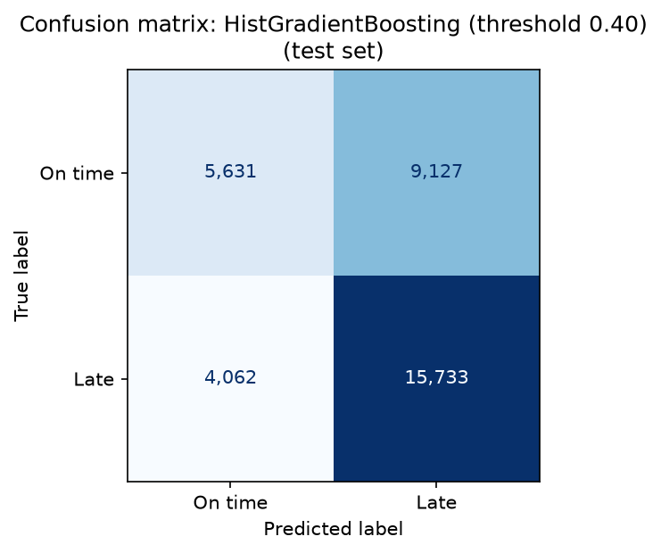
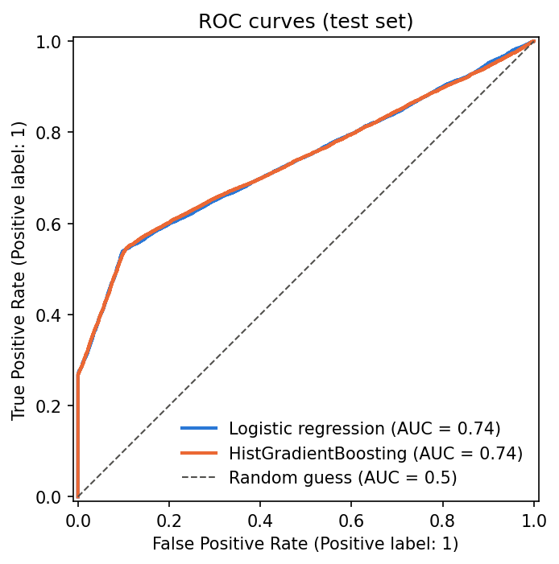
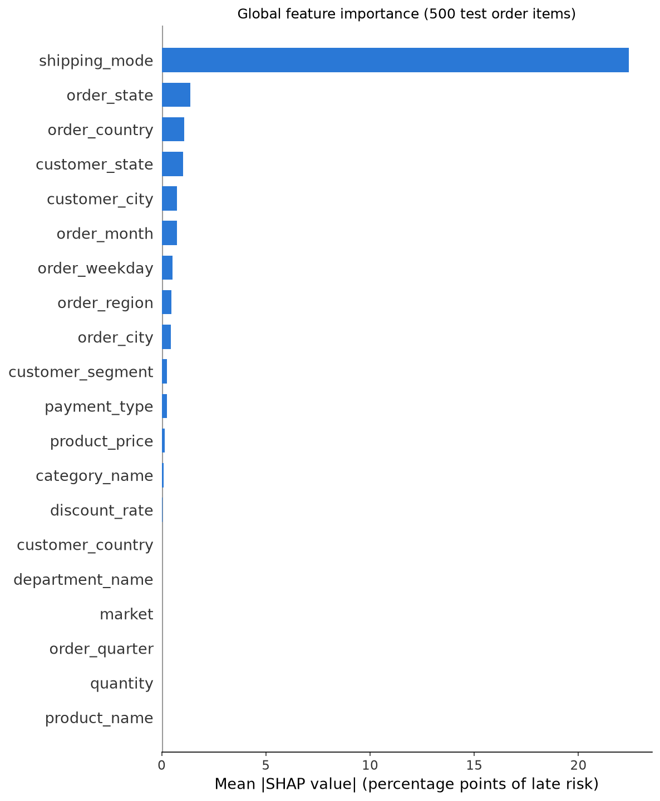
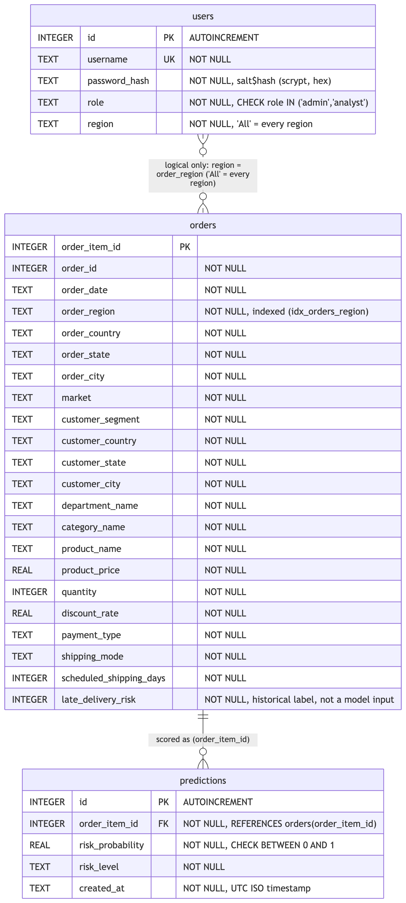
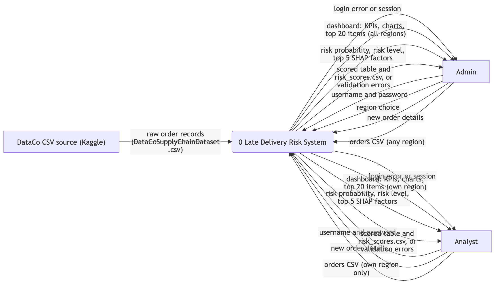
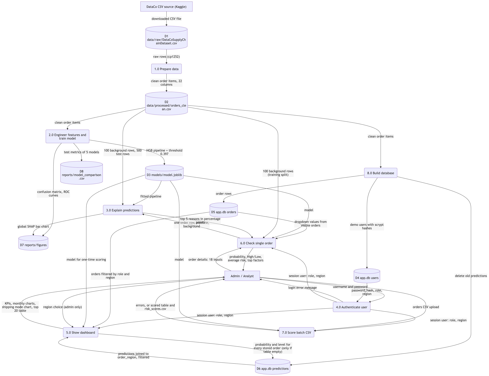

# Part 3: Results, Life Cycle, Manual and Annexures

<!--
Draft generated from repository facts (code, docs/, reports/, docs/ai-use-log.md) on 2026-09-30.
Every [FILL: ...] marker must be completed by the student. Every reference marked "verify"
must be checked against the source before submission; no reference detail was guessed.
Section numbers continue from Part 1 (sections 1-3) and Part 2 (sections 4-7).
-->

---

## 8. System Maintenance and Evaluation

### 8.1 Model Comparison

All models were trained on the same 138,209 training order items (50,315 orders) and evaluated on the same untouched test set of 34,553 order items (12,579 orders). The split was grouped by order, so no order appears in both sets. The cross-validation (CV) columns come from order-grouped 5-fold cross-validation on the training set. The other columns are measured on the test set, with "late" as the positive class.

**Table 8.1: Model comparison (source: `reports/model_comparison.csv`)**

| Model | CV ROC-AUC (± std) | Accuracy | Precision | Recall | F1 | Test ROC-AUC |
|---|---|---|---|---|---|---|
| Always late (baseline) | 0.500 (± 0.000) | 0.573 | 0.573 | 1.000 | 0.728 | 0.500 |
| Shipping mode only (baseline) | 0.742 (± 0.004) | 0.695 | 0.883 | 0.539 | 0.670 | 0.739 |
| Logistic regression | 0.742 (± 0.005) | 0.694 | 0.859 | 0.557 | 0.676 | 0.731 |
| HistGradientBoosting (threshold 0.5) | 0.740 (± 0.005) | 0.690 | 0.833 | 0.574 | 0.679 | 0.732 |
| **HistGradientBoosting, tuned threshold 0.397 (final model)** | 0.740 (± 0.005) | 0.618 | 0.633 | **0.795** | **0.705** | 0.732 |

The CSV file labels the last model "threshold 0.40" because it rounds to two decimals; the exact saved threshold is 0.397.

Four observations follow from this table:

1. All three learned models rank orders almost equally well. Their CV ROC-AUC values (0.740 to 0.742) differ by less than one standard deviation (0.005).
2. The shipping-mode-only baseline ranks as well as the full models (test ROC-AUC 0.739). Almost all of the predictive signal in this dataset comes from the shipping mode (see section 8.4).
3. The "always late" baseline has recall 1.0 but no ranking ability (ROC-AUC 0.5). Recall on its own is therefore not enough to judge a model.
4. At the default threshold of 0.5, every learned model misses more than 40% of late deliveries (recall 0.539 to 0.574).

I kept `HistGradientBoostingClassifier` as the final model even though its CV ROC-AUC is not higher than logistic regression's. [FILL: my reason for keeping the tree-based model, in my own words]

The tree model was tuned over 8 combinations:
- learning rate 0.05 or 0.1
- maximum leaf nodes 15 or 31
- 200 or 400 iterations

The selected setting was learning rate 0.1, 15 leaf nodes and 200 iterations.

### 8.2 Chosen Threshold and Why

For this business, a missed late delivery (false negative) is more costly than a false alarm (false positive). A missed late delivery means no early action and a disappointed customer, while a false alarm only costs some extra attention from the operations team. I therefore treated **recall on late deliveries** as the primary metric and set a target of at least 80% recall.

I chose the threshold without using the test set:

1. I computed out-of-fold predicted probabilities for every training item with order-grouped 5-fold cross-validation.
2. I selected the **highest** threshold whose out-of-fold recall was at least 0.80. This is **0.397**. Taking the highest such threshold keeps as many true on-time orders as possible out of the "High" group.
3. I saved the model with this threshold fixed (`FixedThresholdClassifier` wrapping the frozen pipeline) in `models/model.joblib`.

On the test set, the tuned threshold raises recall from 0.574 to **0.795** and F1 from 0.679 to 0.705. Precision falls from 0.833 to 0.633. Test recall is slightly below the 0.80 target, which is expected when a threshold chosen on training data is applied to new data. In the application, an order is labelled **High** risk when its predicted probability is at least 0.397 and **Low** otherwise.

### 8.3 Confusion Matrix

**Table 8.2: Confusion matrix of the final model on the test set (34,553 order items)**

| | Predicted on time | Predicted late |
|---|---|---|
| **Actually on time** (14,758) | 5,631 (true negatives) | 9,127 (false positives) |
| **Actually late** (19,795) | 4,062 (false negatives) | 15,733 (true positives) |

- **Late deliveries caught:** 15,733 of 19,795, which is 79.5% (recall).
- **Late deliveries missed:** 4,062, which is 20.5%.
- **Flags that were correct:** of the 24,860 items flagged High risk, 15,733 were actually late, which is 63.3% (precision).
- **False alarms:** the other 9,127 flagged items, 36.7%, were delivered on time.

The figure is `reports/figures/08_confusion_matrix.png` (Figure [FILL: number]), and the ROC curves of the models are in `reports/figures/09_roc_curves.png` (Figure [FILL: number]).

### 8.4 SHAP Findings

**Method.** I used SHAP's PermutationExplainer on the predicted probability of "late", with 100 training rows as background and seed 42. The code checks on every call that the baseline plus all SHAP values equals the model's predicted probability.

**Global importance.** Figure [FILL: number] (`reports/figures/10_shap_global_importance.png`) shows the mean absolute SHAP value per feature over 500 test order items.

- **Shipping mode** dominates, with a mean effect of about **22 percentage points** of late risk.
- The next features are order state, order country, customer state, customer city and order month. Each has a mean effect below about 1.5 percentage points.
- Several features have almost no effect, including quantity, product name, market, order quarter, department name and customer country.

This matches the data itself:

| Shipping mode | Late rate |
|---|---|
| First Class | 100% (26,512 of 26,512 items) |
| Second Class | 79.8% |
| Same Day | 47.9% |
| Standard Class | 39.8% |

The label appears to depend mainly on how the scheduled delivery time is set for each shipping mode.

**Local explanations.** In the application, the order risk checker lists the top five factors of a single order in plain language. One order I checked in the running application on 2026-09-28 was a First Class order to Belize:

- **Predicted risk:** 100.0%, High, against an average of 57.5% for the background sample.
- **Top factor:** "Shipping mode 'First Class' increased risk by 41.8 percentage points".
- **Other four factors:** each changed the risk by 0.4 percentage points or less.

**Why not TreeExplainer.** SHAP's faster TreeExplainer produced values that did not add up to the model's output for `HistGradientBoostingClassifier`'s native categorical splits, off by up to 3 log-odds. I therefore used the model-agnostic PermutationExplainer. Its cost is speed: about 3 seconds per explained order.

**Repeatability.** SHAP applies the random seed once, when the explainer is built. The application therefore builds a new explainer for each request, which takes about 0.02 seconds, so the same order always receives the same explanation. A test checks this (EX-02).

### 8.5 System Maintenance

| Task | How | When |
|---|---|---|
| Retrain the model | Put the new DataCo-format file in `data/raw/`, then run `src.data_prep`, `src.train`, `src.explain` and `src.db` in order (see `docs/setup.md`). Training re-tunes the hyperparameters and re-chooses the threshold on out-of-fold predictions. | When new order data is available, or when monitoring shows recall falling [FILL: retraining frequency agreed with the business, if any] |
| Check the model after retraining | Compare the new `reports/model_comparison.csv` with Table 8.1. Confirm recall on the test set is still close to 0.80, and that the shipping-mode baseline is not better than the model. | After every retraining |
| Run the tests | `.venv/bin/python -m pytest` (107 tests) | After any code or library change |
| Rebuild the database | `.venv/bin/python -m src.db`. This reloads the orders and clears the saved predictions, which the application recomputes at the next login. Existing users are kept. | After new data or a new model |
| Back up | Copy `data/app.db`, `models/model.joblib` and `data/processed/orders_clean.csv` while the application is stopped. These files are git-ignored. | [FILL: backup frequency] |
| Library versions | Versions are pinned in `requirements.txt`. One test helper uses a private Streamlit attribute and works only with the pinned Streamlit 1.64.0; it must be re-checked if Streamlit is upgraded. | Before any upgrade |
| Leakage control | Any new column must be classified as known at order time or recorded later before it is used. Tests fail if a leakage column appears in the clean data or in the feature list. | Whenever the data source changes |

---

## 9. Cost and Benefit Analysis

This analysis is qualitative. No cost or savings figures were measured in this project. Every money figure must come from a real source and is marked [FILL].

### 9.1 Costs

| Cost item | Description | Amount |
|---|---|---|
| Software | All software used is free and open source: Python, pandas, numpy, scikit-learn, shap, matplotlib, joblib, Streamlit, pytest and SQLite. No licences were bought. | [FILL: confirm 0, or list any paid tool] |
| Data | The DataCo Smart Supply Chain dataset was downloaded from Kaggle. | [FILL: cost, if any; check the dataset licence] |
| Hardware | One existing personal computer; no GPU and no server. | [FILL: hardware cost, or "existing equipment"] |
| Development effort | Design, coding, testing and documentation | [FILL: man-hours spent, and the cost basis if one is required] |
| AI coding assistant | Claude Code was used for development assistance (see the AI-assistance disclosure) | [FILL: subscription cost, if it is to be included] |
| Operation | The system runs locally; there are no hosting or API costs | [FILL: estimated running cost, if any] |
| Maintenance | Periodic retraining, testing and backups (section 8.5) | [FILL: estimated effort per period] |

### 9.2 Benefits

| Benefit | How the system provides it |
|---|---|
| Early warning of late deliveries | The final model flags about 80% of late items at the time the order is placed (test recall 0.795), before shipping. |
| Explainable decisions | Every single-order prediction comes with its top five factors, so staff can see why an order is at risk, not just that it is. |
| Actionable insight | The analysis shows that shipping mode drives almost all of the risk. This points process improvements at how delivery times are scheduled for each mode. |
| Faster review of many orders | Batch CSV scoring validates and scores a whole file of orders and returns a downloadable result. |
| Data separation and security | Analysts see only their own region; passwords are hashed; SQL is parameterized; uploads are validated. |
| Low running cost | The system uses only open-source software and runs on one local machine without external services. |
| Monetary benefit | For example, fewer customer complaints or refunds from late deliveries handled in advance | [FILL: estimated savings from a real business source; not measured in this project] |

### 9.3 Trade-offs

The chosen threshold favours catching late deliveries over precision. About 37% of orders flagged High risk (9,127 of 24,860 in the test set) are in fact delivered on time. Whether this is worthwhile depends on the cost of reviewing a flagged order compared with the cost of a missed late delivery. [FILL: these unit costs, if the business can provide them]. With those two costs, the threshold could be re-chosen to minimise total cost instead of targeting 80% recall.

---

## 10. Detailed Life Cycle of the Project

### 10.1 Life Cycle Phases

The project followed an iterative, module-by-module life cycle. Each module was written, run, reviewed and tested before the next one was started. The dates below are from `docs/ai-use-log.md`, and the planned schedule is in the PERT chart (section 5).

| Phase | Work done | Output | Date(s) |
|---|---|---|---|
| 1. Requirement analysis | Project scope and rules defined; university guidelines turned into a requirements checklist | `CLAUDE.md`, `docs/requirements-checklist.md` | 2026-09-27 |
| 2. Environment setup | Git repository, folder structure, Python virtual environment. The tree model was changed to scikit-learn's `HistGradientBoostingClassifier` after XGBoost and LightGBM needed an extra system library. | `.gitignore`, `requirements.txt` | 2026-09-27 |
| 3. Data understanding | Profiling of all 53 raw columns (types, missing values, class balance) and classification of each column as known at order time, leakage, or drop | `docs/data-dictionary.md` | 2026-09-27 |
| 4. Data preparation | `src/data_prep.py` written, reviewed and corrected | `data/processed/orders_clean.csv` (172,762 × 22) | 2026-09-27 |
| 5. Exploratory data analysis | Seven late-rate charts | `notebooks/01_eda.ipynb`, figures 01 to 07 | 2026-09-27 |
| 6. Feature engineering | Date parts, final list of 20 features, preprocessing for each model type | `src/features.py` | 2026-09-27 |
| 7. Model training and evaluation | Grouped split, baselines, logistic regression, tuned HistGradientBoosting, threshold tuning, comparison table and figures; re-run in the project environment with the pinned library versions | `src/train.py`, `models/model.joblib`, figures 08 and 09 | 2026-09-27 to 2026-09-28 |
| 8. Explainability | SHAP method chosen after testing showed that TreeExplainer was incorrect for this model; global figure and local explanations | `src/explain.py`, figure 10 | 2026-09-28 |
| 9. Database design | SQLite schema, password hashing, region filtering; ERD | `src/db.py`, `docs/diagrams/erd.md` | 2026-09-28 |
| 10. Application development | Streamlit application with login, dashboard, risk checker and batch scoring | `app.py` | 2026-09-28 |
| 11. Testing | 107 automated tests; two defects found and fixed | `tests/`, `docs/test-report.md` | 2026-09-28 to 2026-09-30 |
| 12. Documentation | DFD, architecture, ML pipeline and PERT diagrams; user manual; hardware and software list; setup guide | `docs/`, `reports/figures/diagrams/` | 2026-09-30 |
| 13. Deployment and submission | Local installation as described in `docs/setup.md`; report and soft copy submitted | This report, source code | [FILL: submission date] |

Code review was built into the cycle. A review was carried out after each module (data preparation, training, explanation, database), and the fixes I accepted were applied before moving on. All of this is recorded in `docs/ai-use-log.md`.

### 10.2 Entity Relationship Diagram (ERD)

**Figure [FILL: number]: ERD of the SQLite database** (`reports/figures/diagrams/erd.png`)

The database `data/app.db` has three tables:

- **users** (id, username, password_hash, role, region). The username is unique, and the role must be `admin` or `analyst`.
- **orders** (order_item_id as primary key, plus the 21 other columns of the clean dataset). There is an index on `order_region`.
- **predictions** (id, order_item_id, risk_probability, risk_level, created_at). `order_item_id` is a foreign key to `orders`, and the probability must be between 0 and 1.

One order item can have zero or more predictions. The link between `users.region` and `orders.order_region` is logical only; it is enforced in the query code.

### 10.3 Data Flow Diagrams (DFD)

**Figure [FILL: number]: DFD Level 0 (context diagram)** (`reports/figures/diagrams/dfd_level0.png`)

**Figure [FILL: number]: DFD Level 1** (`reports/figures/diagrams/dfd_level1.png`)

At Level 0, the system exchanges data with three external entities:

- the DataCo CSV source, which provides the raw order records
- the admin
- the analyst

Admins and analysts send login details, order details and CSV files, and receive dashboards, risk scores, explanations and scored files.

Level 1 breaks the system into eight processes:

1. prepare data
2. engineer features and train the model
3. explain predictions
4. authenticate the user
5. show the dashboard
6. check a single order
7. score a batch CSV
8. build the database

These processes read and write eight data stores: the raw CSV, the clean CSV, the model file, the users, orders and predictions tables, the figures, and the model comparison table.

The system architecture and the ML pipeline flow are shown in sections 4.3 and 6 (Figures [FILL: numbers]).

### 10.4 Input and Output Screen Design

The application has four screens and a sidebar. The screenshots below go in `reports/figures/screenshots/`.

**Figure [FILL: number]: Login screen (input)**

- **Inputs:** Username, Password (hidden) and a **Log in** button.
- **Output on failure:** "Wrong username or password." The same message is shown for an unknown user and for a wrong password.

**Figure [FILL: number]: Risk dashboard, admin view (output)**

**Figure [FILL: number]: Risk dashboard, analyst view (output)**

The dashboard shows:

- **Four KPIs:** order items, actual late rate, predicted high risk, and average predicted risk.
- **Two monthly line charts:** order items per month, and the actual late rate per month. Months without orders appear as gaps.
- **A bar chart:** actual late rate against average predicted risk by shipping mode.
- **A table:** the 20 highest-risk order items.

The two roles see different data:

- **Admin:** has a **Region** drop-down ("All regions" or one region). In the running application on 2026-09-28, the admin's all-regions view showed 172,762 order items, an actual late rate of 57.3%, 71.5% predicted high risk and an average predicted risk of 57.3%.
- **Analyst:** sees only "Region: Central America". The same day, the analyst's view showed 27,174 order items, an actual late rate of 57.1%, 73.2% predicted high risk and an average predicted risk of 56.8%.

**Figure [FILL: number]: Order risk checker (input and output)**

- **Inputs:** linked drop-downs, in three groups:
  - Destination: order region, then country, state and city (the market is shown automatically)
  - Customer and product: segment; customer country, state and city; department, then category and product
  - Order details: order date, payment type, shipping mode, product price, quantity and discount rate
- **Action:** a **Check risk** button.
- **Outputs:**
  - the probability of late delivery
  - the risk level (High or Low)
  - the average risk of the background sample
  - the top five factors, in percentage points

**Figure [FILL: number]: Batch scoring (input and output)**

- **Input:** a CSV file with the 18 required columns. `docs/sample_batch.csv` is a 20-row example that passes validation.
- **Output:** either a list of validation errors, or:
  - a summary line ("Scored N rows: H high risk, L low risk.")
  - the scored table sorted by risk
  - a **Download results (CSV)** button that saves `risk_scores.csv`

The sidebar shows the logged-in user and role, the region access, the page choice (Dashboard, Order risk checker, Batch scoring) and a **Log out** button.

### 10.5 Methodology Used for Testing

I used **pytest** for automated testing, and **Streamlit's AppTest** (`streamlit.testing.v1`) to run the real application and log in through its login form. The testing approach was:

- **Unit tests** for each function, using small hand-made data. They cover data preparation steps, feature engineering, training utilities, database functions and upload validation.
- **Data-quality tests** on the real clean dataset: no leakage columns, no missing values, unique order item IDs and a binary target.
- **Leakage tests:**
  - no leakage, target or ID column is in the feature list
  - no order appears in both the training and test sets
- **Security tests:**
  - passwords are stored only as salted hashes
  - wrong passwords and SQL-injection usernames are rejected
  - analysts see only their own region, including an analyst whose region text is "All"
  - uploads with rows from another region are rejected
- **Integration tests with AppTest:** the real application is logged into as the demo analyst and admin. The database is opened **read-only**, so tests cannot change it.
- **Negative tests:** invalid inputs must raise errors or be rejected. Examples are missing columns, invalid dates, text prices, quantities of 0 or 2.5, discounts outside 0 to 1, infinite prices, unknown order items and out-of-range probabilities.
- **Test isolation:** tests use temporary files and databases (pytest `tmp_path`) and never write to project data, models or figures. The full model training is not run in the tests because it is too slow; its functions are tested on small synthetic data.

When a test revealed a defect, the test was first kept as an expected failure with the reason recorded. After the fix, it became a normal passing test.

### 10.6 Test Report

The full test report, with one row per test, is in `docs/test-report.md`. Summary of the final run on 2026-09-30:

**Table 10.1: Test summary**

| Module | Test file | Tests | Passed |
|---|---|---|---|
| src/data_prep.py | tests/test_data_prep.py | 19 | 19 |
| src/features.py | tests/test_features.py | 10 | 10 |
| src/train.py | tests/test_train.py | 14 | 14 |
| src/db.py | tests/test_db.py | 37 | 37 |
| src/explain.py | tests/test_explain.py | 3 | 3 |
| app.py (validation, scoring, access control) | tests/test_app_logic.py | 24 | 24 |
| **Total** | | **107** | **107** |

pytest result: `107 passed, 3 warnings in 13.69s`. The warnings come from inside the shap library, not from project code.

**Defects found and fixed:**

| ID | Defect | Fix | Verified by |
|---|---|---|---|
| KI-1 | The batch upload accepted a product price of "inf" (infinity) and scored the row. | Infinite values in numeric columns are treated as invalid, so the file is rejected. | AP-15 |
| KI-2 | If saving a batch of predictions failed part-way, the rows saved before the error stayed pending and could be committed later. | The batch insert runs in a transaction that is rolled back on error. | DB-35 |

**Checked manually, not by automated tests:**

- the file-upload widget and the download button
- the visual rendering of the charts
- the full order-risk-checker flow in the browser
- the Log out button
- a full model training run

The application was checked by hand in the running Streamlit app on 2026-09-28.

---

## 11. User / Operational Manual (Summary)

The full manual is `docs/user-manual.md`. This section summarises it.

**Installation and start.** Follow `docs/setup.md` from the project root:

1. Create the virtual environment and install `requirements.txt`.
2. Place the dataset in `data/raw/`.
3. Run `src.data_prep`, `src.train` and `src.db` with `.venv/bin/python`.
4. Start the application with `.venv/bin/streamlit run app.py`. It opens at `http://localhost:8501`.

If a required file is missing, the application names it and lists the commands to run.

**Logging in.** The demo accounts are `admin`, which sees all regions, and `analyst`, which sees Central America. Their default passwords apply only to local demos and can be replaced with the environment variables `DEMO_ADMIN_PASSWORD` and `DEMO_ANALYST_PASSWORD` when the database is built.

**Using the screens.**

- **Dashboard:** read the KPIs and trends. Admins can choose a region.
- **Order risk checker:** describe a new order and press **Check risk**. The explanation takes about 3 seconds.
- **Batch scoring:** upload a CSV with the 18 required columns and download the results. Batch results are not saved in the database.

**Access rights.**

| Capability | Admin | Analyst |
|---|---|---|
| Dashboard data | All regions | Own region only (filtered in the SQL query) |
| Region selector | Yes | No |
| Risk checker choices | All orders | Own-region orders only |
| Batch scoring | Any region | Own region only; otherwise the file is rejected |
| User management in the app | No | No |

**Security controls.**

- salted scrypt password hashes
- constant-time password comparison
- the same error message for an unknown user and a wrong password
- role-based filtering inside the SQL queries
- parameterized SQL only
- database constraints (unique username, allowed roles, probability between 0 and 1, foreign keys)
- validation of uploaded files
- local-only operation

The system does **not** have account lockout, a password-change screen or a login audit log.

**Backup.** The application has no built-in backup. Stop the application and copy `data/app.db`, `models/model.joblib` and `data/processed/orders_clean.csv` to a backup folder. These files are git-ignored. To restore, copy them back and restart the application.

**Troubleshooting.** The manual explains each message the user can see:

- missing files
- a wrong username or password
- a rejected upload and its reasons
- a file that cannot be read
- gaps in the monthly charts
- a slow first page after a database rebuild

---

## 12. Limitations and Future Scope

### 12.1 Limitations

1. **The model is dominated by shipping mode.** The full model (test ROC-AUC 0.732) does not rank orders better than a baseline that uses only the shipping mode (0.739). Every First Class item is labelled late (26,512 of 26,512), so the label mostly reflects how delivery times are scheduled for each mode.
2. **There are many false alarms.** At the chosen threshold, precision is 0.633: about 37% of High-risk flags are on-time deliveries.
3. **The data is historical and has gaps.** It covers January 2015 to January 2018, and some regions have months without orders. For example, Central America has none from June 2015 to December 2016.
4. **The dashboard's predictions include training orders.** Its predicted-risk figures are therefore more favourable than they would be on new orders. The dashboard shows a caption saying so.
5. **The system is local and single-user in practice.** It is not connected to a live order system. If two sessions open the application at the same moment on a freshly built database, the one-time scoring could run twice.
6. **Explanations are slow.** One explanation takes about 3 seconds, because the correct method (PermutationExplainer) is slower than the tree-specific one.
7. **User management is limited.** There is no screen for adding users or changing passwords, and there is no account lockout or audit log.
8. **Some rare values are treated as missing.** Categories seen fewer than 500 times in training are grouped, and a value never seen in training is treated as missing by the tree model. The explanation text does not yet flag the unseen case.

### 12.2 Future Scope

The following are proposals. None of them is implemented.

1. **Add features that describe delays beyond the shipping mode.** Examples are carrier, warehouse or origin, and distance, collected at order time, to increase the model's signal.
2. **Use cost-based thresholds.** With real costs for a missed late delivery and a false alarm, choose the threshold that minimises total expected cost.
3. **Calibrate probabilities and add more risk levels.** Calibrate the predicted probabilities and consider three risk levels (Low, Medium, High) once a second cut-off can be justified.
4. **Monitor and retrain.** Track recall and the late rate on new orders, and retrain automatically when they drift.
5. **Integrate with order systems.** Score orders directly from an order-management system instead of through CSV upload.
6. **Strengthen security and administration.** Add account lockout, a password-change screen, a user-management screen for admins, and an audit log.
7. **Speed up explanations.** Cache explanations for repeated orders, or use a faster exact method if one becomes available for native categorical splits.
8. **Serve more users.** Move from SQLite to a server database and deploy the application for multiple concurrent users.

---

## 13. Conclusion

In this project I built a complete, locally running system that predicts, at the time an order is placed, the risk that an order item will be delivered late, and explains each prediction.

- **Data:** starting from 180,519 raw rows and 53 columns, I produced a clean dataset of 172,762 order items. It contains only information known at order time, with every post-shipping column excluded and the exclusion checked by tests.
- **Model:** a HistGradientBoosting model with a threshold of 0.397, chosen on training data only, catches 79.5% of late deliveries in the untouched test set, with precision 0.633 and ROC-AUC 0.732.
- **Explanations:** SHAP explanations, verified to add up to the model's output, show that shipping mode is by far the most important factor. This finding is useful in itself for the business.
- **Application:** the Streamlit application makes the model usable for two roles, with hashed passwords, parameterized SQL, region-level access and validated uploads.
- **Testing:** 107 automated tests pass, and the two defects they found were fixed.

The main strengths of the work are the systematic prevention of data leakage, the business-driven threshold, the correctness check on the explanations, and the tested role-based application. [FILL: my own closing remarks on what I learned and what makes the system stand out]

---

# Annexures

## Annexure 1: Brief Background of the Organization

[FILL: organization background, or "NA" if the project was not developed for an organization]

---

## Annexure 2: Data Dictionary

Type is given as Numeric, Alpha, Date or Binary, as the university format requires. "Length" is the maximum text length in the raw data (before spaces were stripped) for Alpha fields, or the storage size in the SQLite database for numbers (8 bytes for SQLite INTEGER and REAL values). "Alias" is the original column name in the raw dataset. The full classification of all 53 raw columns, including excluded and dropped columns and the reasons, is in `docs/data-dictionary.md`.

### A2.1 Orders (clean dataset `data/processed/orders_clean.csv` and table `orders`)

| # | Data name | Alias (raw column) | Length (size) | Type | Role |
|---|---|---|---|---|---|
| 1 | order_item_id | Order Item Id | 8 bytes | Numeric (integer) | Key (primary key), not a feature |
| 2 | order_id | Order Id | 8 bytes | Numeric (integer) | Key, used to group the split; not a feature |
| 3 | order_date | order date (DateOrders) | 16 characters (raw text) | Date | Feature (month, weekday, quarter derived) |
| 4 | order_region | Order Region | 15 | Alpha | Feature; also used for access control |
| 5 | order_country | Order Country | 31 | Alpha | Feature |
| 6 | order_state | Order State | 36 | Alpha | Feature |
| 7 | order_city | Order City | 35 | Alpha | Feature |
| 8 | market | Market | 12 | Alpha | Feature |
| 9 | customer_segment | Customer Segment | 11 | Alpha | Feature |
| 10 | customer_country | Customer Country | 11 | Alpha | Feature |
| 11 | customer_state | Customer State | 5 | Alpha | Feature |
| 12 | customer_city | Customer City | 20 | Alpha | Feature |
| 13 | department_name | Department Name | 18 | Alpha | Feature |
| 14 | category_name | Category Name | 20 | Alpha | Feature |
| 15 | product_name | Product Name | 45 | Alpha | Feature |
| 16 | product_price | Order Item Product Price | 8 bytes | Numeric (decimal) | Feature |
| 17 | quantity | Order Item Quantity | 8 bytes | Numeric (integer) | Feature |
| 18 | discount_rate | Order Item Discount Rate | 8 bytes | Numeric (decimal) | Feature |
| 19 | payment_type | Type | 8 | Alpha | Feature |
| 20 | shipping_mode | Shipping Mode | 14 | Alpha | Feature |
| 21 | scheduled_shipping_days | Days for shipment (scheduled) | 8 bytes | Numeric (integer) | Kept, but not a model input (one-to-one with shipping_mode) |
| 22 | late_delivery_risk | Late_delivery_risk | 8 bytes | Binary (0/1) | Target (historical outcome; never a model input) |

Derived model features (not stored): order_month (Numeric, 1 to 12), order_weekday (Numeric, 0 = Monday to 6), order_quarter (Numeric, 1 to 4). All three are treated as categories by the model.

### A2.2 Table `users`

| # | Data name | Alias | Length (size) | Type | Description |
|---|---|---|---|---|---|
| 1 | id | NA | 8 bytes | Numeric (integer) | Primary key, auto-increment |
| 2 | username | NA | NA (variable text) | Alpha | Unique login name |
| 3 | password_hash | NA | 161 characters (32 hex characters of salt + "$" + 128 hex characters of hash) | Alpha | Salted scrypt hash; never the plain password |
| 4 | role | NA | NA (variable text) | Alpha | `admin` or `analyst` (database CHECK) |
| 5 | region | NA | NA (variable text) | Alpha | `All` for admin, or one order region |

### A2.3 Table `predictions`

| # | Data name | Alias | Length (size) | Type | Description |
|---|---|---|---|---|---|
| 1 | id | NA | 8 bytes | Numeric (integer) | Primary key, auto-increment |
| 2 | order_item_id | NA | 8 bytes | Numeric (integer) | Foreign key to orders.order_item_id |
| 3 | risk_probability | NA | 8 bytes | Numeric (decimal) | Predicted probability of late delivery, 0 to 1 (database CHECK) |
| 4 | risk_level | NA | NA (variable text) | Alpha | `High` (probability ≥ 0.397) or `Low` |
| 5 | created_at | NA | 32 characters | Date (text, UTC ISO 8601) | Time the prediction was saved |

---

## Annexure 3: List of Abbreviations, Figures and Tables

### A3.1 Abbreviations

| Abbreviation | Meaning |
|---|---|
| AI | Artificial Intelligence |
| API | Application Programming Interface |
| AUC | Area Under the Curve |
| CSV | Comma-Separated Values |
| CV | Cross-Validation |
| DFD | Data Flow Diagram |
| ERD | Entity Relationship Diagram |
| FK | Foreign Key |
| FN / FP | False Negative / False Positive |
| GPU | Graphics Processing Unit |
| HGB | HistGradientBoosting (scikit-learn `HistGradientBoostingClassifier`) |
| KPI | Key Performance Indicator |
| LLM | Large Language Model |
| ML | Machine Learning |
| PERT | Program Evaluation and Review Technique |
| PK | Primary Key |
| RBAC | Role-Based Access Control |
| ROC | Receiver Operating Characteristic |
| SHAP | SHapley Additive exPlanations |
| SQL | Structured Query Language |
| TN / TP | True Negative / True Positive |
| UTC | Coordinated Universal Time |
| venv | Python virtual environment |

### A3.2 List of Figures

[FILL: final figure numbers and page numbers once all report parts are assembled]

| Figure | Title | File |
|---|---|---|
| [FILL] | Overall late delivery rate | reports/figures/01_late_rate_overall.png |
| [FILL] | Late rate by shipping mode | reports/figures/02_late_rate_by_shipping_mode.png |
| [FILL] | Late rate by market and region | reports/figures/03_late_rate_by_market_region.png |
| [FILL] | Late rate by product category | reports/figures/04_late_rate_by_category.png |
| [FILL] | Late rate by customer segment | reports/figures/05_late_rate_by_customer_segment.png |
| [FILL] | Late rate by order month | reports/figures/06_late_rate_by_order_month.png |
| [FILL] | Late rate by scheduled shipping days | reports/figures/07_late_rate_by_scheduled_days.png |
| [FILL] | Confusion matrix of the final model | reports/figures/08_confusion_matrix.png |
| [FILL] | ROC curves of the models | reports/figures/09_roc_curves.png |
| [FILL] | Global SHAP feature importance | reports/figures/10_shap_global_importance.png |
| [FILL] | Entity Relationship Diagram | reports/figures/diagrams/erd.png |
| [FILL] | DFD Level 0 | reports/figures/diagrams/dfd_level0.png |
| [FILL] | DFD Level 1 | reports/figures/diagrams/dfd_level1.png |
| [FILL] | System architecture | reports/figures/diagrams/architecture.png |
| [FILL] | ML pipeline flow | reports/figures/diagrams/ml_pipeline.png |
| [FILL] | PERT chart | reports/figures/diagrams/pert.png |
| [FILL] | Login screen | reports/figures/screenshots/login.png |
| [FILL] | Risk dashboard, admin view | reports/figures/screenshots/dashboard_admin.png |
| [FILL] | Risk dashboard, analyst view | reports/figures/screenshots/dashboard_analyst.png |
| [FILL] | Order risk checker | reports/figures/screenshots/risk_checker.png |
| [FILL] | Batch scoring | reports/figures/screenshots/batch_scoring.png |

### A3.3 List of Tables

[FILL: page numbers; number the remaining tables marked [FILL] when the report is assembled]

| Table | Title | Location |
|---|---|---|
| [FILL] | Software used (synopsis) | Part 1, Synopsis section 6 |
| [FILL] | Late rate by shipping mode | Part 1, section 2.1 |
| [FILL] | Confusion matrix (theory example) | Part 1, section 2.5 |
| 4.1 | Functional requirements | Part 2, section 4.1 |
| 4.2 | Non-functional requirements | Part 2, section 4.1 |
| [FILL] | Column classification summary | Part 2, section 4.2 |
| [FILL] | Design decisions | Part 2, section 4.3 |
| 5.1 | PERT activities | Part 2, section 5.1 |
| [FILL] | Code organisation | Part 2, section 7.2 |
| [FILL] | Hardware used | Part 2, section 7.3 |
| [FILL] | Software used | Part 2, section 7.4 |
| 8.1 | Model comparison | Part 3, section 8.1 |
| 8.2 | Confusion matrix of the final model | Part 3, section 8.3 |
| [FILL] | System maintenance tasks | Part 3, section 8.5 |
| [FILL] | Costs and benefits | Part 3, section 9 |
| [FILL] | Life cycle phases | Part 3, section 10.1 |
| 10.1 | Test summary | Part 3, section 10.6 |
| [FILL] | Access rights | Part 3, section 11 |
| [FILL] | Data dictionary tables A2.1 to A2.3 | Annexure 2 |

---

## Annexure 4: References

Each entry below still needs checking. The details marked "verify" (authors, year, volume, pages, URL, access date) must be checked against the original source before submission and formatted in the university's bibliography style. No detail has been filled in from memory.

### Bibliography

1. **DataCo Smart Supply Chain dataset.** "DataCo Smart Supply Chain for Big Data Analysis", Kaggle dataset.
   - **verify:** dataset authors or uploader, year, version, the original source publication if Kaggle cites one, the licence, and the exact URL.
   - [FILL: access date]
2. **scikit-learn paper.** "Scikit-learn: Machine Learning in Python", Journal of Machine Learning Research.
   - **verify:** authors, year, volume, pages.
3. **SHAP paper.** "A Unified Approach to Interpreting Model Predictions" (introduces SHAP).
   - **verify:** authors, conference or proceedings name, year, pages.

### Websites (library documentation)

For every entry: **verify** the exact URL; [FILL: access date].

4. pandas documentation, version 3.0.6.
5. NumPy documentation, version 2.5.3.
6. scikit-learn documentation, version 1.9.1. The relevant pages are HistGradientBoostingClassifier, FixedThresholdClassifier, StratifiedGroupKFold and GridSearchCV.
7. SHAP documentation, version 0.52.0. The relevant page is PermutationExplainer.
8. Matplotlib documentation, version 3.11.2.
9. joblib documentation, version 1.6.0.
10. Streamlit documentation, version 1.64.0. The relevant pages include `streamlit.testing.v1.AppTest`.
11. pytest documentation, version 9.1.1.
12. Python standard library documentation: `sqlite3`, `hashlib.scrypt` and `hmac.compare_digest`, for Python 3.12.

[FILL: any other sources I cited in the report text, for example the citation markers in Part 1, section 2]

---

## Annexure 5: Soft Copy of the Project

[FILL: university drive link where the soft copy (source code repository and report) is submitted]

---

## Annexure 6: Guide Details

| Item | Details |
|---|---|
| Guide name | [FILL: guide name] |
| Full address | [FILL: full address] |
| Qualification | [FILL: qualification] |
| Mobile | [FILL: mobile number] |
| Email | [FILL: email address] |

---

## Annexure 7: Certificate from Guide (Annexure A format)

**CERTIFICATE FROM GUIDE**

This is to certify that this project entitled "AI-Driven Late Delivery Risk Prediction and Explainable Insights System for Logistics" submitted in partial fulfillment of the degree of M.Sc (Data Science) to Chandigarh University done by [FILL: Mr./Ms.] Vijay Anand E, Roll No. O23MSD110005 is an authentic work carried out by him/her under my guidance. The matter embodied in this project work has not been submitted earlier for award of any degree or diploma to the best of my knowledge and belief.

| Signature of the student | Signature of the Guide |
|---|---|
| | Date- [FILL: date] |

---

## AI-Assistance Disclosure (for the Acknowledgement)

The following paragraph is to be added to the Acknowledgement page:

> In developing the software for this project I used an AI coding assistant, Claude Code (Anthropic), to help write and review code, write automated tests, and produce documentation artifacts such as diagrams, the data dictionary, the test report and the user manual. The AI assistant was also used to help draft parts of this report from the project's own files and results. I defined the project scope and rules, reviewed and ran all code, made the design decisions (including the leakage-free feature list, the model choice and the decision threshold), and checked all results. Every significant AI-assisted task, the tool used and what I reviewed or changed is recorded in the project's AI-use log (`docs/ai-use-log.md`), which is included with the soft copy of the project. [FILL: adjust this paragraph so that it accurately describes my own use of the tool]
